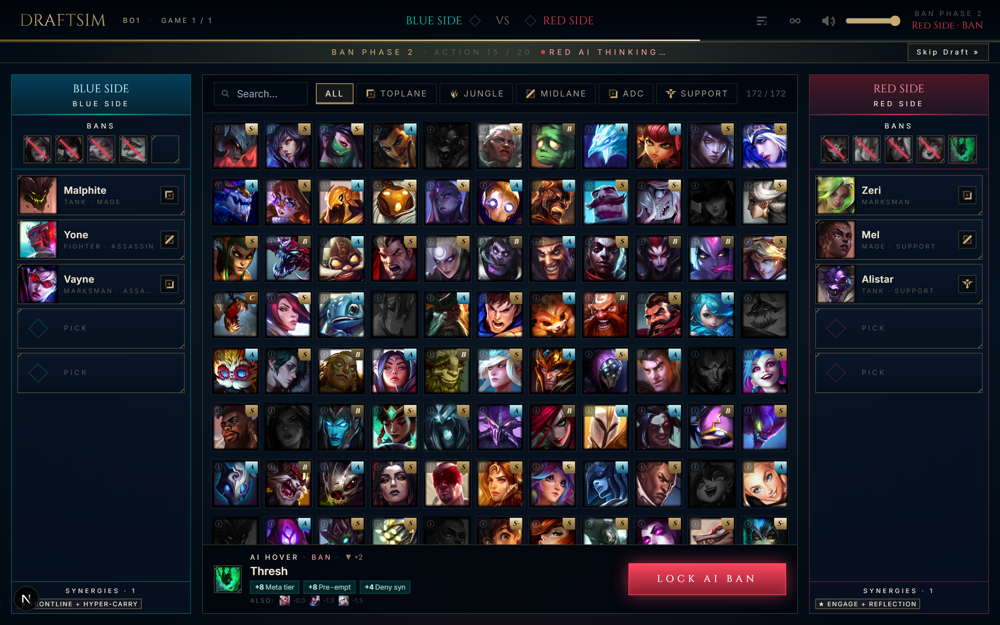
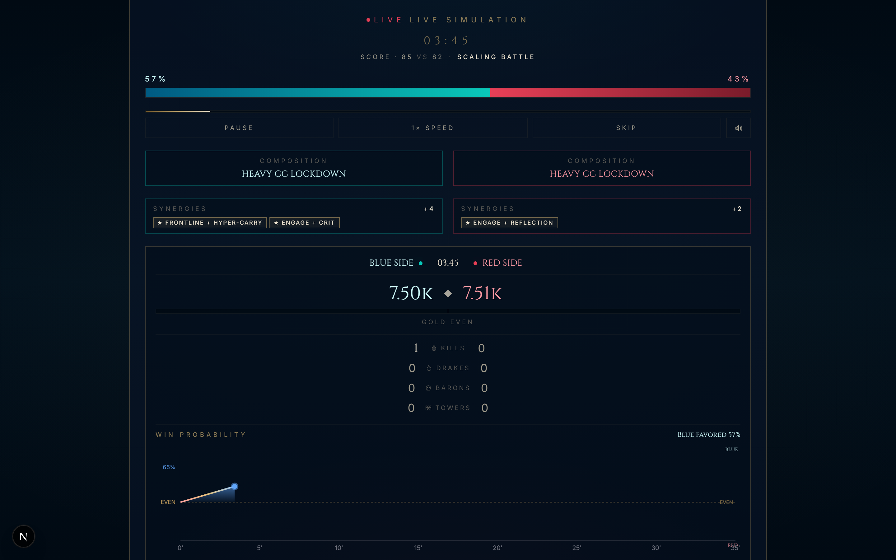
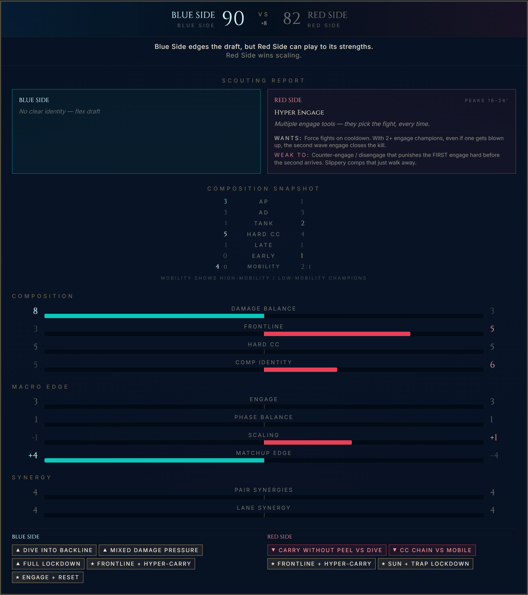
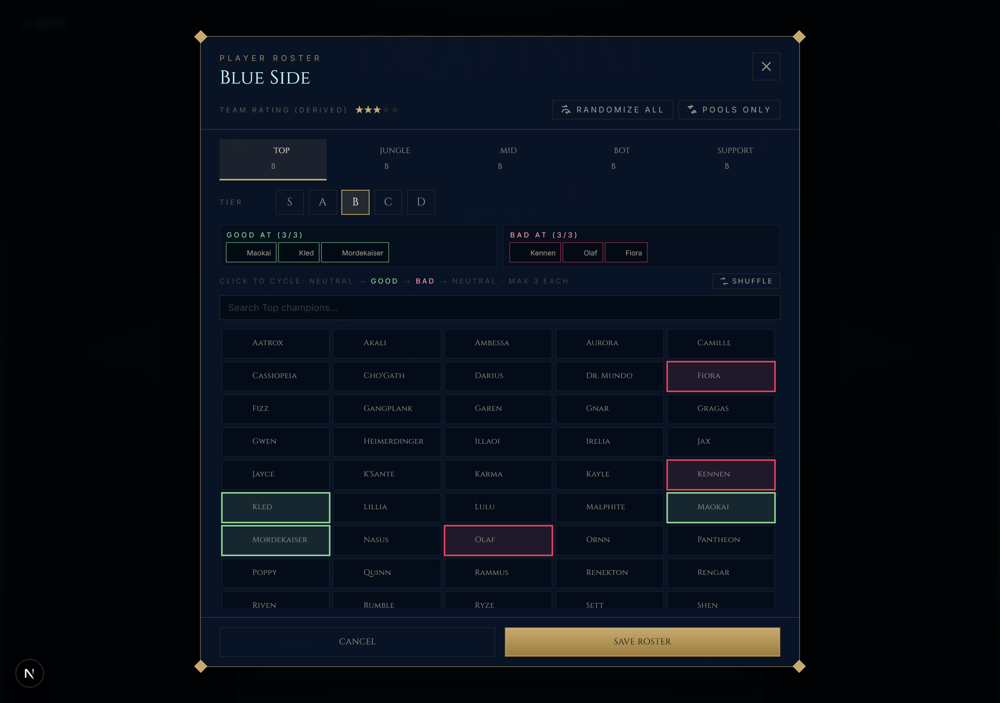
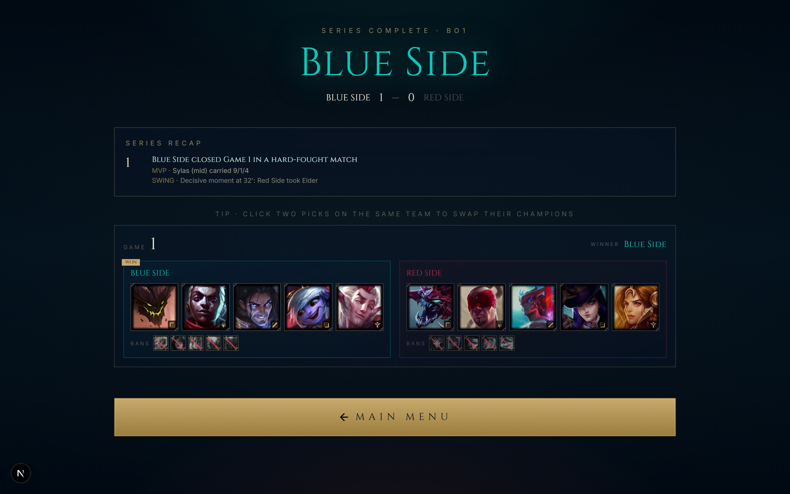

# DraftSim

A Windows desktop simulator for League of Legends drafts, matches, tournaments and multi-year franchises. Draft against the AI, set a game plan, follow the match timeline, or simulate entire competitive seasons across six regions.

Built with **Tauri 2**, **React 19**, **Next.js 16**, **TypeScript** and **Rust**, with local **SQLite** saves. Code, identifiers and interface text are primarily in English.

[Español](README.es.md) · [Download installers](https://github.com/nbfrodri/draftsim/releases) · [Game systems](docs/systems.md)

## Install on Windows

Open [GitHub Releases](https://github.com/nbfrodri/draftsim/releases) and choose one installer for Windows x64:

| Installer | File | Use |
|---|---|---|
| NSIS | `DraftSim_<version>_x64-setup.exe` | Standard setup wizard |
| MSI | `DraftSim_<version>_x64_en-US.msi` | Windows Installer package |

Both install the same application. Releases are produced from version tags after automated checks pass. If no release is listed yet, build the installers locally using the instructions below.

DraftSim uses Microsoft Edge WebView2. The installer handles its installation when necessary; that bootstrap may require internet access. The champion catalogue is packaged with the app, while remote artwork, audio and optional data refreshes need a connection. There is no hosted web deployment.

## What you can play

Read the [v0.9.0 release notes](docs/releases/v0.9.0.md) for tournament highlights, clearer results, roster cards and consistent typography.

Desktop saves include unfinished seasons. Inactive realities load on demand; Backups offers optional local save diagnostics. See the [persistence guide](docs/persistence-and-recovery.md) for storage format 8 migration and recovery.

The Hall also includes **Roster Moves**: chronological market history per reality, including the current year, with year/window/team/region/role filters and player-status badges. Older archives show only the events they actually retained.

Team strength supports **half stars (1 to 5)** throughout setup, roster displays, rankings, market decisions and interactive/bulk simulation. Existing saves remain compatible; completed results are preserved. See [the team-strength contract](docs/technical-design.md#half-star-team-strength).

- **Single series:** pick/ban against another player or the AI, or watch AI vs AI; best-of series, fearless drafting and optional player rosters.
- **Match simulation:** set a War Room strategy and follow kills, objectives, gold, win probability, MVPs and post-match recaps.
- **Tournaments:** single/double elimination, round robin, Swiss, Swiss with playoffs, and groups with playoffs.
- **Seasons:** LCK, LPL, LEC, LCS, CBLOL and LCP; Winter, Spring and Summer; First Stand, MSI, Worlds and Global Cup.
- **Franchises / Realities:** multi-year timelines, transfers, aging, academy, free agency, career records, the Hall of Seasons and bulk simulation.
- **International MVPs:** Live Results shows each event champion’s tournament MVP, lane and rating when match statistics are available.
- **Results:** live split standings with expandable team lists and team history with recorded placements (`#1`, `#2`, etc.). Older archives without a recorded placement show that it is unavailable.
- **Customization:** champion meta tiers, player rosters, team identities and simulation settings.

The [systems reference](docs/systems.md) explains drafting, match simulation and franchise behavior in detail.

## Champion records

Open **Records & Dynasties → Most played champions** for the selected reality's archived champion usage: games, wins, losses and global win rate. Show Top 10 / 25 / 50 / all champions, then expand one to see its Top 3 / 5 / 10 players, position icons and profile cards. WR is blue above 50%, red below 50% and neutral at 50%. Incomplete historical pools display a coverage notice.

## Title Playground

Open **Season History → select a reality → Title Playground** to explore archived team and player titles through stacked bars and a cumulative timeline.

- Filter by region, individual split or international competition, and an inclusive range of years.
- Switch between teams and players; filter players by the position they played when winning each title.
- Search, show Top 10 / Top 25 / all competitors, or pick a custom comparison.
- Use team logos, position icons and competition badges to identify competitors; select a row for the exact winning years, clubs and regions.
- Player titles belong to the region and position at the time of the win. Later transfers do not change their attribution.

Works with existing realities and keeps their histories separate. Older archives with missing roster identities show a coverage notice instead of guessing player winners. The themed dropdowns support keyboard navigation. See the [Title Playground guide](docs/title-playground.md) for counting rules and controls.

The team Pie chart shows each visible team's share of selected titles, with logos or names on sectors and optional percentage labels. It follows the region, competition, year and comparison filters.

Player profiles include Most frequent teammates: shared seasons counted once per year, shared events and expandable years with titles won together and Timeline shortcuts. Titles require both players on the winning event's recorded roster.

Hover team and player names for profile cards. In the breakdown, click counts, competitions, years, teams or regions to filter the table; the button beside each year opens it in Timeline.

Player Career History and team Results History include expandable roster snapshots for each recorded event, with cards pinned to that event and a Close roster button. Newly archived seasons retain every champion played in each player's champion pool. Existing realities support these changes; champions discarded from older capped summaries cannot be recovered automatically.


## Best Rosters of All Time

The Hall ranks lineups of the same five player identities by international titles, then split titles. Filter by winning region and year range, inspect the five-player snapshot with profile cards, and filter each roster's title history by Winter, Spring, Summer, First Stand, MSI, Worlds or Global Cup. Timeline shortcuts open the winning year. Titles without a complete event roster are excluded with a coverage notice.

## Live player search and backup controls

Open **Find a player** in Live Results to search players, view their card and current team/status, and inspect movements retained in the live feed. Suggestions and movements use team icons and Academy, FA and Retired badges. Search indexing runs only while searching and reuses movement data across roster updates.

The backups panel supports deleting individual local copies with confirmation and disabling an external backup destination without removing existing external files. Existing realities backfill their permanent name registry from retained history when opened or imported, preventing future reuse of those names; existing duplicate identities are not renamed.

## Gallery

| Draft | Match simulation |
|---|---|
|  |  |

| Team comparison | Roster editor | Series recap |
|---|---|---|
|  |  |  |

## Develop locally

Windows prerequisites:

- Node.js **22.12+** and npm.
- Rust stable with the MSVC toolchain, installed through [rustup](https://rustup.rs/).
- Visual Studio Build Tools with **Desktop development with C++** and the Windows SDK.
- Microsoft Edge WebView2. See [Tauri's Windows prerequisites](https://v2.tauri.app/start/prerequisites/#windows).

```powershell
npm ci
npm run desktop:dev
```

Tauri starts the Next.js development server and opens a native window with hot reload. The browser frontend remains available for local UI development and automated tests; its storage is separate from desktop SQLite saves.

```powershell
npm run dev       # Local UI development at http://localhost:3000
npm run build     # Compile the interface and worker into out/
npm run preview   # Local production preview at http://127.0.0.1:3000
```

Next.js is the desktop UI build system. Its static export is embedded in Tauri; the installed application does not run a Node.js server. Builds use the bundled champion catalogue and do not fetch champion data from external APIs.

## Build installers

From a Windows development environment:

```powershell
npm run desktop:build
```

This checks version consistency, builds the frontend once and bundles both installers:

```text
src-tauri/target/release/bundle/nsis/DraftSim_<version>_x64-setup.exe
src-tauri/target/release/bundle/msi/DraftSim_<version>_x64_en-US.msi
```

Distribute the installers. `src-tauri/target/release/app.exe` is a build output, not a separately packaged portable release. Automated distribution currently targets Windows x64.

## Publish a version

The [Windows release workflow](.github/workflows/release.yml) runs when a tag such as `v0.2.0` is pushed. It verifies versions, runs the [project checks](.github/workflows/ci.yml), and publishes a GitHub Release containing both installers with generated release notes. Assets are staged in a draft before the complete release becomes public.

Prepare a release from a clean working tree:

```powershell
npm version 0.2.0 --no-git-tag-version
npm run check
npm run test:desktop
npm run desktop:build
```

The npm `version` hook synchronizes `src-tauri/tauri.conf.json`, `src-tauri/Cargo.toml` and the application entry in `src-tauri/Cargo.lock`. npm updates `package.json` and `package-lock.json`. Review and commit the changes, then tag that commit:

```powershell
git add package.json package-lock.json src-tauri/tauri.conf.json src-tauri/Cargo.toml src-tauri/Cargo.lock
git commit -m "Release 0.2.0"
git tag v0.2.0
git push origin HEAD
git push origin v0.2.0
```

Use stable `X.Y.Z` versions. The tag must exactly match all version files. MSI supports major/minor values up to 255 and patch values up to 65535. The workflow uses the repository's built-in `GITHUB_TOKEN` with release-write access only in the publishing job; no personal token is needed.

A failed draft upload can be retried by rerunning the workflow. Published releases are not overwritten: create a new version for changes. Installer signing and automatic in-app updates are not configured.

## Checks and maintenance

| Command | Purpose |
|---|---|
| `npm run check` | Version consistency, release-tool tests, lint, TypeScript, unit tests and frontend build |
| `npm run lint` / `npm run typecheck` | Static checks |
| `npm test` / `npm run test:watch` | Simulation and application unit tests |
| `npm run test:release` | Version validation and synchronization tests |
| `npm run test:desktop` | Rust/SQLite tests using the Cargo lockfile |
| `npm run test:e2e` | Browser regression tests against `out/` |
| `npm run check:version` | Verify npm, Tauri and Cargo versions |
| `npm run refresh-champions` | Refresh the packaged champion catalogue |
| `npm run refresh-data` | Refresh bundled Meraki abilities and items |
| `npm run fetch-player-names` | Refresh pro player handles |
| `npm run fetch-team-logos` | Download team logos |
| `npm run fetch-rookie-names` / `npm run fetch-coaches` | Refresh roster reference data |
| `npm run build:worker` | Bundle the bulk simulation worker; automatic before dev/build |
| `npm run calibrate` | Measure draft strength against simulated win rates |

Browser tests require a production build and a Playwright browser:

```powershell
npm run build
npx playwright install chromium
npm run test:e2e
```

Alternatively, use an installed Edge browser with `$env:PLAYWRIGHT_CHANNEL='msedge'`. These tests exercise the shared interface; they do not test native IPC. Windows CI separately builds both installers and tests NSIS installation, reopening, legacy migration and reinstall persistence on a disposable runner. The installer smoke script refuses personal workstations. MSI is built and uploaded but does not yet have a separate installation smoke test.

Data refresh scripts require network access. Review their generated data changes before committing. For AI calibration in PowerShell:

```powershell
$env:CALIB_DRAFTS='600'
$env:CALIB_SIMS_PER_DRAFT='40'
npm run calibrate
```

## Saves and backups

Desktop saves live in:

```text
%APPDATA%\app.draftsim.desktop\draftsim.db
```

The app identifier remains `app.draftsim.desktop` across updates. Legacy JSON saves migrate to SQLite and are retained as `.bak` files after migration. See [desktop storage](docs/desktop-sqlite-storage.md).

- Export important realities as `.draftsim-reality.json` and seasons as `.draftsim-season.json`.
- Tournament exports use `.draftsim.json`; share codes use `TOUR1:`, `REAL1:` and `META1:`.
- For a full database backup, close the app before copying `draftsim.db`.
- Use the in-app backup panel before importing or deleting data you want to retain.

## Repository guide

| Path | Contents |
|---|---|
| `app/`, `components/` | Next.js entry points and React interface |
| `lib/draftAI/`, `lib/sim/` | Draft scoring and match simulation |
| `lib/season/` | Seasons, franchises, rosters, placements and history |
| `lib/desktopStorage.ts`, `lib/desktopSqlite.ts` | Persistence adapters and SQLite |
| `store/` | Zustand state and actions |
| `src-tauri/` | Rust shell, native commands and installer configuration |
| `scripts/` | Data maintenance, builds, versions and installer checks |
| `e2e/` | Shared-interface browser regressions |
| `.github/workflows/` | Project checks and Windows releases |
| `docs/` | Systems, architecture and implementation notes |

Generated outputs (`out/`, `.next/`, `src-tauri/target/`, test reports) are gitignored.

## Further documentation

- [Technical documentation index (ES)](docs/README.md)
- [Architecture](docs/technical-design.md) · [Domain contracts](docs/domain-contracts.md)
- [Persistence and recovery](docs/persistence-and-recovery.md) · [Interaction and execution](docs/interaction-and-execution.md)
- [Development, diagnostics and releases](docs/development-and-release.md)

- [Game systems (EN)](docs/systems.md) · [Sistemas (ES)](docs/systems.es.md)
- [Tournament formats](docs/tournament-mode.md) · [Player rosters](docs/players-feature.md)
- [Player identity and franchises](docs/player-identity-and-franchise.md)
- [Season realism](docs/season-realism.md) · [Reality sharing](docs/reality-sharing.md)
- [SQLite storage](docs/desktop-sqlite-storage.md) · [Save performance](docs/performance-franchise-saves.md)

## Use of AI

AI has been used to assist with the development and documentation of this project.

## Attribution

Unofficial fan-made project, not affiliated with Riot Games. League of Legends names, champion artwork, icons and sound effects belong to Riot Games. CommunityDragon and Meraki Analytics provide community data mirrors; roster reference data also uses Leaguepedia. Third-party assets retain their owners' rights.
