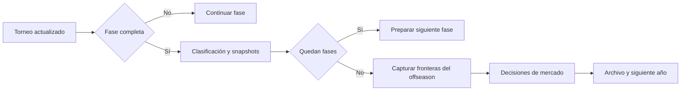

# Dominio: temporadas, identidad, premios y offseason

Este documento complementa el [diseño técnico](technical-design.md). Describe invariantes que deben mantenerse aunque cambien la interfaz o los formatos competitivos.

## 1. Fuentes de verdad

El motor anual está en `lib/season/engine.ts`; la continuidad entre años y evolución de plantillas, en `lib/season/franchise.ts`. `lib/season/types.ts` define sus contratos. La UI consume esos resultados y no debe decidir por separado cuándo termina un año o a qué temporada pertenece un movimiento.

| Pregunta | Fuente de evidencia |
|---|---|
| ¿Qué equipo ganó una partida? | Resultado y equipos azul/rojo de esa partida |
| ¿Quién jugó en una fase? | Identidades y snapshots de esa fase |
| ¿En qué región ganó un jugador? | Contexto regional del equipo al ganar |
| ¿Pertenece un movimiento al offseason actual? | Sello de origen y frontera del offseason |
| ¿Ganó un jugador un All-Pro concreto? | Scope y miembros de la selección archivada |
| ¿Está completa la temporada? | Fases y transición del motor anual |

El nombre es presentación; el ID permite relacionar entidades. No deben fusionarse jugadores o equipos homónimos. Cambiar de equipo o de rol no reescribe la propiedad histórica de un título.

## 2. Calendario y transiciones

`LEAGUE_IDS` establece LCK, LPL, LEC, LCS, CBLOL y LCP. Los splits son Winter, Spring y Summer. Los internacionales incluyen First Stand, MSI, Worlds y Global Cup cuando corresponde al calendario de franquicia.

La temporada conserva `phases`, `phaseIndex` y un mapa de torneos. Los formatos y ventanas dependen de la configuración; duplicar en componentes una secuencia fija crea discrepancias con el motor. Una temporada con Global Cup no debe abrir el offseason simplemente porque haya terminado Worlds.

`applyTournamentUpdate` coordina resultados y efectos de finalización. Reaplicar una actualización completa no debe duplicar premios, repetir noticias ni restablecer las fronteras que ya separan el mercado nuevo del histórico.

Las plantillas de torneo y los snapshots de fase son evidencia histórica. Una actualización del roster anual no debe convertir automáticamente al recién fichado en ganador de una competición anterior.

## 3. Dos tipos de eventos de plantilla

`transfersByEvent` guarda movimientos agrupados por internacional de referencia. Cada movimiento puede contener un sello `event` que permite recuperar su procedencia aunque el bucket sea incorrecto.

`rosterNews` registra otras novedades de plantilla, como incorporaciones, rookies o bajas, con un `timeMark`. Estos arrays no son equivalentes: tienen distintos productores y necesitan fronteras separadas.

La plantilla actual no sirve para deducir cuándo ocurrió un movimiento. Tampoco basta con que una fila lleve la etiqueta `Offseason`: puede tratarse del offseason del año anterior que se conserva como contexto al iniciar el nuevo año.

## 4. Fronteras del offseason

Los eventos nuevos incluyen `origin: { seasonId, year, windowId }`, construido por `marketOrigin`. Ese origen se conserva al importar, guardar, archivar y avanzar de año. Los filtros prefieren esa propiedad explícita. Para compatibilidad con filas antiguas, al completarse el calendario anual se capturan dos longitudes:

| Campo | Qué separa |
|---|---|
| `worldsOffseasonBaseline` | Carry previo dentro del bucket Worlds frente a movimientos nuevos |
| `offseasonRosterNewsBaseline` | Noticias ya presentes frente a noticias añadidas tras abrir el mercado |

`currentOffseasonRosterNews` selecciona el origen del offseason actual. Para filas sin origen, selecciona noticias posteriores a la frontera cuyo `timeMark` es `Offseason`. La combinación importa: una condición temporal no sustituye a la otra.

`transfersForDigestEvent` respeta el sello del movimiento y excluye carry anterior en el offseason de una temporada completa. `transfersForHistoryArchive` prepara los movimientos del archivo. `rebucketTransfersByStamp` reconstruye la agrupación según procedencia.

### Ejemplo de propiedad temporal

| Momento real | Registro | ¿Offseason actual del año 2? |
|---|---|---|
| Offseason del año 1 | Rookie A, arrastrado al año 2 | No |
| Winter del año 2 | Incorporación B | No |
| Offseason del año 2 | Fichaje C, posterior a la frontera | Sí |

Guardar, recargar y abrir otra vista no debe cambiar estas respuestas. El filtro de Winter puede mostrar B y el historial puede conservar A sin que ninguno reaparezca como C.

### Restricciones del modelo por índices

Las fronteras de filas antiguas suponen que el array mantiene su orden de inserción. Los eventos con origen explícito no dependen de la posición. Ordenar la tabla debe hacerse sobre una copia. Eliminar o reordenar filas anteriores a la frontera exige actualizarla o migrar a otro modelo de propiedad.

La reparación de noticias de agencia al cubrir vacantes debe respetar el momento y la ventana. Encontrar el mismo equipo y rol en una noticia antigua no autoriza a reescribirla como si acabara de producirse.

## 5. Rollover y compatibilidad

`startNextSeason` transporta al nuevo año los movimientos pertinentes del offseason de cierre. Un movimiento sellado como First Stand pero ubicado por error en Worlds no debe convertirse en offseason durante ese transporte.

Cuando un conjunto ya ha sido filtrado para excluir carry, no se le puede aplicar otra vez la frontera del array original. La doble aplicación omite movimientos válidos. El código reinicia esa frontera en la representación ya filtrada destinada al archivo.

Las partidas completas antiguas pueden carecer de `offseasonRosterNewsBaseline`. `initializeOffseasonRosterNewsBoundary` conserva todas las noticias y utiliza su longitud como frontera inicial. Solo las nuevas filas se atribuyen con certeza al offseason actual.

Esta decisión es conservadora: una noticia antigua que realmente pertenecía al offseason actual puede no aparecer en ese filtro si falta evidencia de su origen. No se elimina el registro original ni se inventa un año. Las importaciones deben conservar esta distinción entre desconocido y conocido.

**Propuesta futura:** añadir `seasonId`, año y `windowId` a cada evento de mercado. Eso reduciría la dependencia de índices, pero necesita migración y compatibilidad. No forma parte del modelo implementado actualmente.

## 6. Premios y participación

### Rookie of the Year

Estar en una plantilla no acredita participación. La selección requiere partidos registrados y un rating válido antes de ordenar candidatos. El caso sin candidatos válidos debe permanecer vacío; elegir el primer nombre disponible puede generar un premio con cero partidos y rating cero.

Los tests deben cubrir tanto ausencia total de participación como candidatos con datos válidos y otros sin ellos. No basta con comprobar que el ganador existe en el roster.

### All-Pro

`lib/season/allProScopes.ts` define categorías inequívocas:

| Scope | Etiqueta visible |
|---|---|
| `split-league` | Domestic Split All-Pro |
| `split-global` | Global Split All-Pro |
| `season-global` | All-Pro Team of the Year |

Los internacionales no conceden un All-Pro específico de su evento. Esta regla no implica excluir automáticamente sus partidos de toda estadística anual: las fuentes de una métrica y el ámbito de un premio son conceptos distintos.

`archivedAllProCounts` prefiere selecciones explícitas con IDs de miembros. Cuando faltan, usa los contadores de ámbitos conocidos y expone integridad de la información. Un antiguo total ambiguo no puede reinterpretarse como una categoría moderna.

## 7. Estadísticas y archivo

El archivo anual alimenta timeline, perfiles, búsquedas y récords. Las agregaciones deben conservar identidad, región y rol del momento correspondiente. El roster actual no puede sustituir snapshots ausentes sin marcar la pérdida de cobertura.

Dato ausente no equivale a cero. Convertirlo puede crear falsos líderes o mínimos históricos. Los archivos antiguos deben mostrar cobertura incompleta cuando corresponda, sin reconstruir información descartada que ya no existe.

Los equipos se identifican dentro del contexto de competición. Azul y rojo pueden intercambiarse entre partidas; las victorias de serie y los logos de recap se resuelven con los equipos de cada partida.

## 8. Contratos visuales compartidos

- Campeones y MVPs de split usan `LEAGUE_IDS` para mantener el mismo orden regional, salvo rankings ordenados explícitamente por valor.
- En Split Champions, la región y su logo se presentan en la etiqueta regional; no se repiten junto a cada equipo de la misma fila.
- Los tabs de partidas muestran el equipo ganador con su logo, no solo R/B.
- Los stats en vivo muestran icono de rol para MVP e iconos de campeones para Most Contested y Best Win Rate.
- Longest Series no forma parte de esa sección de stats.
- Bulk Simulation empieza plegada; su disclosure no modifica las reglas de simulación.

## 9. Matriz mínima de regresión

| Caso | Resultado requerido |
|---|---|
| Rookie sin partidos | No obtiene un premio por pertenecer al roster |
| All-Pro internacional | No se crea selección específica del evento |
| Carry + noticia Winter + offseason nuevo | Solo el último pertenece al offseason actual |
| Guardar y recargar | Mismos límites y mismos resultados del filtro |
| Worlds con Global Cup pendiente | No adelantar el cierre anual |
| Actualización completa repetida | No reiniciar las fronteras |
| Dos rollovers consecutivos | No acumular carry de años anteriores |
| Bucket incorrecto, sello correcto | Conservar el origen real |
| Archivo antiguo sin frontera | Preservar filas sin inventar procedencia |
| Intercambio de lados | Logo y victoria atribuidos al equipo correcto |

Fuentes: [engine](../lib/season/engine.ts), [franchise](../lib/season/franchise.ts), [transfers](../lib/season/transfers.ts), [rosterNews](../lib/season/rosterNews.ts), [history](../lib/season/history.ts), [allProScopes](../lib/season/allProScopes.ts). Los tests próximos a estos archivos y las pruebas [E2E](../e2e/season-ui-navigation.spec.ts) verifican capas distintas del contrato.

Las importaciones validan un origen opcional tanto en noticias como en transferencias y archivo anual. Un origen mal formado se rechaza; su ausencia no se rellena con el año actual. Las pruebas incluyen dos rollovers tras serializar y recargar, con movimientos anteriores en el mismo bucket y fronteras que ya no coinciden con el orden de las filas nuevas.
