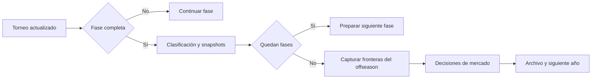

# Dominio: temporadas, identidad, premios y offseason

Este documento complementa el [diseño técnico](technical-design.md). Describe invariantes que deben mantenerse aunque cambien la interfaz o los formatos competitivos.

## 1. Fuentes de verdad

El motor anual está en `lib/season/engine.ts`; la continuidad entre años y evolución de plantillas, en `lib/season/franchise.ts`. `lib/season/types.ts` define sus contratos. La UI consume esos resultados y no debe decidir por separado cuándo termina un año o a qué temporada pertenece un movimiento.

| Pregunta | Fuente de evidencia |
|---|---|
| ¿Qué equipo ganó una partida? | Resultado y equipos azul/rojo de esa partida |
| ¿Quién jugó en una fase? | Identidades y snapshots de esa fase |
| ¿En qué región ganó un jugador? | Contexto regional del equipo al ganar |
| ¿Pertenece un movimiento al offseason actual? | Sello de origen y frontera del offseason |
| ¿Ganó un jugador un All-Pro concreto? | Scope y miembros de la selección archivada |
| ¿Está completa la temporada? | Fases y transición del motor anual |

El nombre es presentación; el ID permite relacionar entidades. No deben fusionarse jugadores o equipos homónimos. Cambiar de equipo o de rol no reescribe la propiedad histórica de un título.

## 2. Calendario y transiciones

`LEAGUE_IDS` establece LCK, LPL, LEC, LCS, CBLOL y LCP. Los splits son Winter, Spring y Summer. Los internacionales incluyen First Stand, MSI, Worlds y Global Cup cuando corresponde al calendario de franquicia.

La temporada conserva `phases`, `phaseIndex` y un mapa de torneos. Los formatos y ventanas dependen de la configuración; duplicar en componentes una secuencia fija crea discrepancias con el motor. Una temporada con Global Cup no debe abrir el offseason simplemente porque haya terminado Worlds.

`applyTournamentUpdate` coordina resultados y efectos de finalización. Reaplicar una actualización completa no debe duplicar premios, repetir noticias ni restablecer las fronteras que ya separan el mercado nuevo del histórico.

Las plantillas de torneo y los snapshots de fase son evidencia histórica. Una actualización del roster anual no debe convertir automáticamente al recién fichado en ganador de una competición anterior.

## 3. Dos tipos de eventos de plantilla

`transfersByEvent` guarda movimientos agrupados por internacional de referencia. Cada movimiento puede contener un sello `event` que permite recuperar su procedencia aunque el bucket sea incorrecto.

`rosterNews` registra otras novedades de plantilla, como incorporaciones, rookies o bajas, con un `timeMark`. Estos arrays no son equivalentes: tienen distintos productores y necesitan fronteras separadas.

La plantilla actual no sirve para deducir cuándo ocurrió un movimiento. Tampoco basta con que una fila lleve la etiqueta `Offseason`: puede tratarse del offseason del año anterior que se conserva como contexto al iniciar el nuevo año.

## 4. Fronteras del offseason

Los eventos nuevos incluyen `origin: { seasonId, year, windowId }`, construido por `marketOrigin`. Ese origen se conserva al importar, guardar, archivar y avanzar de año. Los filtros prefieren esa propiedad explícita. Para compatibilidad con filas antiguas, al completarse el calendario anual se capturan dos longitudes:

| Campo | Qué separa |
|---|---|
| `worldsOffseasonBaseline` | Carry previo dentro del bucket Worlds frente a movimientos nuevos |
| `offseasonRosterNewsBaseline` | Noticias ya presentes frente a noticias añadidas tras abrir el mercado |

`currentOffseasonRosterNews` selecciona el origen del offseason actual. Para filas sin origen, selecciona noticias posteriores a la frontera cuyo `timeMark` es `Offseason`. La combinación importa: una condición temporal no sustituye a la otra.

`transfersForDigestEvent` respeta el sello del movimiento y excluye carry anterior en el offseason de una temporada completa. `transfersForHistoryArchive` prepara los movimientos del archivo. `rebucketTransfersByStamp` reconstruye la agrupación según procedencia.

### Ejemplo de propiedad temporal

| Momento real | Registro | ¿Offseason actual del año 2? |
|---|---|---|
| Offseason del año 1 | Rookie A, arrastrado al año 2 | No |
| Winter del año 2 | Incorporación B | No |
| Offseason del año 2 | Fichaje C, posterior a la frontera | Sí |

Guardar, recargar y abrir otra vista no debe cambiar estas respuestas. El filtro de Winter puede mostrar B y el historial puede conservar A sin que ninguno reaparezca como C.

### Restricciones del modelo por índices

Las fronteras de filas antiguas suponen que el array mantiene su orden de inserción. Los eventos con origen explícito no dependen de la posición. Ordenar la tabla debe hacerse sobre una copia. Eliminar o reordenar filas anteriores a la frontera exige actualizarla o migrar a otro modelo de propiedad.

La reparación de noticias de agencia al cubrir vacantes debe respetar el momento y la ventana. Encontrar el mismo equipo y rol en una noticia antigua no autoriza a reescribirla como si acabara de producirse.

## 5. Rollover y compatibilidad

`startNextSeason` transporta al nuevo año los movimientos pertinentes del offseason de cierre. Un movimiento sellado como First Stand pero ubicado por error en Worlds no debe convertirse en offseason durante ese transporte.

Cuando un conjunto ya ha sido filtrado para excluir carry, no se le puede aplicar otra vez la frontera del array original. La doble aplicación omite movimientos válidos. El código reinicia esa frontera en la representación ya filtrada destinada al archivo.

Las partidas completas antiguas pueden carecer de `offseasonRosterNewsBaseline`. `initializeOffseasonRosterNewsBoundary` conserva todas las noticias y utiliza su longitud como frontera inicial. Solo las nuevas filas se atribuyen con certeza al offseason actual.

Esta decisión es conservadora: una noticia antigua que realmente pertenecía al offseason actual puede no aparecer en ese filtro si falta evidencia de su origen. No se elimina el registro original ni se inventa un año. Las importaciones deben conservar esta distinción entre desconocido y conocido.

**Propuesta futura:** añadir `seasonId`, año y `windowId` a cada evento de mercado. Eso reduciría la dependencia de índices, pero necesita migración y compatibilidad. No forma parte del modelo implementado actualmente.

## 6. Premios y participación

### Rookie of the Year

Estar en una plantilla no acredita participación. La selección requiere partidos registrados y un rating válido antes de ordenar candidatos. El caso sin candidatos válidos debe permanecer vacío; elegir el primer nombre disponible puede generar un premio con cero partidos y rating cero.

Los tests deben cubrir tanto ausencia total de participación como candidatos con datos válidos y otros sin ellos. No basta con comprobar que el ganador existe en el roster.

### All-Pro

`lib/season/allProScopes.ts` define categorías inequívocas:

| Scope | Etiqueta visible |
|---|---|
| `split-league` | Domestic Split All-Pro |
| `split-global` | Global Split All-Pro |
| `season-global` | All-Pro Team of the Year |

Los internacionales no conceden un All-Pro específico de su evento. Esta regla no implica excluir automáticamente sus partidos de toda estadística anual: las fuentes de una métrica y el ámbito de un premio son conceptos distintos.

`archivedAllProCounts` prefiere selecciones explícitas con IDs de miembros. Cuando faltan, usa los contadores de ámbitos conocidos y expone integridad de la información. Un antiguo total ambiguo no puede reinterpretarse como una categoría moderna.

## 7. Estadísticas y archivo

El archivo anual alimenta timeline, perfiles, búsquedas y récords. Las agregaciones deben conservar identidad, región y rol del momento correspondiente. El roster actual no puede sustituir snapshots ausentes sin marcar la pérdida de cobertura.

Dato ausente no equivale a cero. Convertirlo puede crear falsos líderes o mínimos históricos. Los archivos antiguos deben mostrar cobertura incompleta cuando corresponda, sin reconstruir información descartada que ya no existe.

Los equipos se identifican dentro del contexto de competición. Azul y rojo pueden intercambiarse entre partidas; las victorias de serie y los logos de recap se resuelven con los equipos de cada partida.

## 8. Contratos visuales compartidos

- Campeones y MVPs de split usan `LEAGUE_IDS` para mantener el mismo orden regional, salvo rankings ordenados explícitamente por valor.
- En Split Champions, la región y su logo se presentan en la etiqueta regional; no se repiten junto a cada equipo de la misma fila.
- Los tabs de partidas muestran el equipo ganador con su logo, no solo R/B.
- Los stats en vivo muestran icono de rol para MVP e iconos de campeones para Most Contested y Best Win Rate.
- Longest Series no forma parte de esa sección de stats.
- Bulk Simulation empieza plegada; su disclosure no modifica las reglas de simulación.

## 9. Matriz mínima de regresión

| Caso | Resultado requerido |
|---|---|
| Rookie sin partidos | No obtiene un premio por pertenecer al roster |
| All-Pro internacional | No se crea selección específica del evento |
| Carry + noticia Winter + offseason nuevo | Solo el último pertenece al offseason actual |
| Guardar y recargar | Mismos límites y mismos resultados del filtro |
| Worlds con Global Cup pendiente | No adelantar el cierre anual |
| Actualización completa repetida | No reiniciar las fronteras |
| Dos rollovers consecutivos | No acumular carry de años anteriores |
| Bucket incorrecto, sello correcto | Conservar el origen real |
| Archivo antiguo sin frontera | Preservar filas sin inventar procedencia |
| Intercambio de lados | Logo y victoria atribuidos al equipo correcto |

Fuentes: [engine](../lib/season/engine.ts), [franchise](../lib/season/franchise.ts), [transfers](../lib/season/transfers.ts), [rosterNews](../lib/season/rosterNews.ts), [history](../lib/season/history.ts), [allProScopes](../lib/season/allProScopes.ts). Los tests próximos a estos archivos y las pruebas [E2E](../e2e/season-ui-navigation.spec.ts) verifican capas distintas del contrato.

Las importaciones validan un origen opcional tanto en noticias como en transferencias y archivo anual. Un origen mal formado se rechaza; su ausencia no se rellena con el año actual. Las pruebas incluyen dos rollovers tras serializar y recargar, con movimientos anteriores en el mismo bucket y fronteras que ya no coinciden con el orden de las filas nuevas.

## 10. Historial de movimientos del Hall

`SeasonHistoryEntry.marketNews` conserva snapshots de noticias con la identidad del equipo del momento. Su ausencia significa que ese archivo antiguo no registraba estas noticias; `[]` significa que se registró la cobertura y no había eventos. `franchiseYear` conserva el año conocido de los nuevos archivos, y los intercambios añaden `inId` y `outId` cuando existen IDs de jugador.

`startNextSeasonWithArchive` devuelve el año siguiente junto con el archivo de cierre, después de generar el mercado automático, los cambios de academia y los retiros. `rollFranchiseToNextYearState` persiste esa salida y el snapshot final de inactivos. Crear el archivo únicamente antes de ejecutar el offseason perdería los eventos generados durante el cierre.

`collectMarketHistory` une el archivo y la temporada actual sin mutarlos. Un intercambio produce dos filas, una por jugador y dirección. La identidad de equipos incluye región y nombre. Los eventos con origen explícito se deduplican contra el carry del año siguiente conservando ocurrencias repetidas dentro de una ventana. El carry antiguo sin origen se contrasta con los archivos disponibles; cuando no se puede atribuir, mantiene año desconocido en lugar de adoptar el año actual.

La fecha visible es el año y la ventana de la simulación. El orden interno entre fuentes de una misma ventana no siempre está registrado. Los estados de origen y destino proceden del tipo de noticia; no se deducen del roster actual. Un retiro antiguo puede tener origen desconocido porque la noticia no distingue si venía de academia o de agencia libre. El equipo asociado a un retiro se muestra como último equipo, no como destino.

Los campos son opcionales y viajan en las exportaciones JSON y en el payload del archivo Excel; no requieren cambiar el formato SQLite. No se reconstruyen noticias que una versión antigua no archivó.

### Snapshots del mercado (2026-09-21)

`MarketTeamSnapshot` guarda identidad de equipo, región y los cinco slots del roster principal antes y después de una actualización. `teamSnapshots` es opcional en `RosterNewsEvent`, `PlayerTransfer` y `HistoryTransfer`. Se clonan jugadores y colecciones anidadas al confirmar el cambio; las noticias ya marcadas con origen no se vuelven a fotografiar al pasar de ventana o año. Las propuestas rechazadas no crean snapshots.

Los intercambios capturan ambos equipos por operación, incluidos los intercambios automáticos de offseason. Las noticias de una actualización automática conjunta comparten los límites anterior/posterior de esa actualización; no se reconstruye un orden intermedio no registrado. Los movimientos de academia que no alteran el roster principal pueden mostrar el mismo roster en ambos lados. El snapshot no incluye el plantel de academia ni las estadísticas competitivas del instante.

El archivo anual conserva `teamSnapshots` y la importación valida identidad, región, slots y campos de jugadores. La lectura del Hall no modifica las partidas ni genera snapshots para movimientos antiguos. Sin snapshot, la card indica que no se registró el roster y no sustituye esa ausencia por el roster actual o por el de cierre de año. Los nombres de jugadores conservan IDs estables y los reemplazos conservan `replacedId` al normalizarse para la vista.

### Academy snapshots and retirement provenance

`MarketTeamSnapshot.academyBefore` / `academyAfter` freeze the players whose inactive status is Academy and whose `lastTeamId` matches the affected team. Missing fields mean unrecorded legacy coverage; empty arrays mean a recorded empty academy. Import validation checks these players like the main roster. News captures the updated inactive pool alongside the updated teams; individual main-roster swaps preserve the unchanged academy pool.

`inactiveTenure` is optional on inactive players and their archived snapshots. New inactive spells start at zero and count each observed season end by the status entering that year-end update. Clock resets and Academy/FA moves preserve these counts. Legacy records remain unknown, even if their badge clock appears to suggest a duration. Retirement news records `retirement.from`, optional `age`, `academyYears` and `freeAgentYears`. The origin is the state before the committed annual lifecycle batch, including retirements caused by pressure valves. Main-roster departures start a new spell; these counters are not lifetime career totals.

The Hall uses recorded year metadata to offer all available years, including years without news. Five rollover/save/load regression coverage verifies ownership and window filters across real SQLite boundaries. Missing archives or news cannot be regenerated from the latest season without inventing history.

### Movement tiers and promotion counterparts

Movement rows use the tier recorded in the event: incoming/outgoing transfer tiers, entrant tier, or departed tier for demotions. Missing legacy tiers remain unknown and can be selected with the Unknown tier filter. Never substitute the player's current tier. Main/academy swaps emit two distinct player rows when `departedDestination` or frozen before/academy-after rosters prove the demotion. Explicit demotion events are deduplicated by season/window/player/team with occurrence counts. No demotion is inferred for a vacant slot or from a replaced name alone.

Agency overrides retain their stored news but are excluded from the movement view because retention is not a move. Preseason is not a selectable Hall window; legacy origin metadata is preserved and remains visible through unfiltered history rather than reassigned to a different year/window. Offseason remains selectable.

Before/After team strength uses the selected frozen main roster: `averageTierFromRoster` and `deriveStar` share existing rounding and star limits with the normal team card. Academy members are shown separately and do not alter the main team's rating. Missing/empty snapshots do not receive invented neutral ratings.

## Team-strength precision

Team stars are numbers on the 1..5 half-step scale, owned by `normalizeTeamStars` in `lib/teamStars.ts`. Main-roster strength uses `deriveStar`; no caller should independently round it to an integer. Roster-bearing teams override cached `starRating` values. A saved series retains its explicit per-team strength, and side swaps move that strength with the team. Integer legacy values remain valid without a persistence migration. Academy players, player match grades, player letter tiers and decimal coach ratings are separate domains. Completed results are immutable; future matches and derived roster summaries can differ under the more precise model.

## Tournament presentation provenance and KDA

`TournamentTeam.leagueId` is an optional snapshot copied by `toTournamentTeam`, including direct qualifiers and play-in entrants. Import validation accepts its absence and rejects unknown region identifiers. The compact codec and share export preserve it through object spreads. For legacy tournaments, the dashboard can fill the display-only region from a stable team ID only when the currently loaded season owns the tournament and matches its `seasonId`. Standalone/unknown teams receive no fabricated region. Duplicate names alone never establish a cross-region identity; old name-only recap records display a region only when the name is unambiguous within the displayed season.

`TournamentState.seasonSubStage?: "play-in"` marks newly created First Stand/MSI/Worlds qualifiers. It is additive and validated on import. Latest Matchday supports legacy qualifier names only within their owning international phase's first tournament; arbitrary standalone names do not establish season provenance. Simulation, qualifier selection and event lifecycle rules are unchanged.

`lib/tournamentMatchContext.ts` is a presentation helper, separate from simulation pressure/round-depth calculations. `SeasonMatchdayMatch.context` is ephemeral and captured before `runAutoPlayMatch` or automatic advancement. Swiss records use decided matches from strictly earlier rounds, including real bye credit; synthetic byes are explicitly labelled and never simulated as played encounters. Knockout names follow advancement edges; winners/losers/last-chance contexts retain their separate meaning.

`lib/formatKda.ts` accepts observed totals or null. An observed zero-death game returns `Perfect KDA`; absent/invalid data returns an em dash. Series summaries count KDA coverage per slot and label partial totals, while preserving per-game player IDs/names. Legacy career aggregates do not record complete KDA coverage: all-zero aggregates remain unavailable rather than claiming perfection. Aggregate ratio formatting does not change numeric rankings or simulator formulas.

These additions require no SQLite migration and do not alter hydration, queued writes, backup or restore boundaries. Compatibility tests operate on disposable import/codec fixtures rather than personal saves.

Tournament cards accept a UI-only `TeamCardHint.tournamentTeam` snapshot. Known season teams retain their standings, academy count and H2H while the roster comes from the tournament. The live card provider indexes active tournament teams by stable ID for bracket/Swiss consumers. `TeamCardData.leagueId` is optional for custom tournaments, without changing stored season-team region requirements. Snapshot hints and focus changes do not modify saves or import formats. A player card first attempts the normal live/history resolution; if no player resolves, an explicit roster hint remains a valid fallback even when its champion pool is empty.

`lib/notableGames.ts` selects recap highlights in one traversal, retaining match ID, game index and per-game side labels. Ties retain the first encountered game. Kill categories require both valid stored totals or complete five-player KDA per missing side; partial or absent stats are not zero. Momentum swing uses the absolute recorded event delta (displayed as percentage points). Largest Gold Lead uses the maximum absolute finite timeline sample; it neither infers a final lead nor assumes the leader won. Missing timelines remain unknown. These summaries are derived display data and require no save migration.

`buildMatchPresentation` maps per-game side, picks, roles and recorded player IDs/names to display identities. A surviving recorded ID blocks fallback to a different roster player's name; a recorded name without an ID cannot borrow a replacement player's ID. Ambiguous aliases and same-named teams remain unresolved instead of borrowing another identity. This is derived UI state, not persisted metadata.

For tournaments with `seasonStageKind`, `computeTournamentAwards().mvp` delegates to the same finals/champion-team selector used by season results. No decided champion or sufficient recorded participation means no MVP. Existing archived awards remain untouched; the consistency correction applies when computing from available tournament results.
