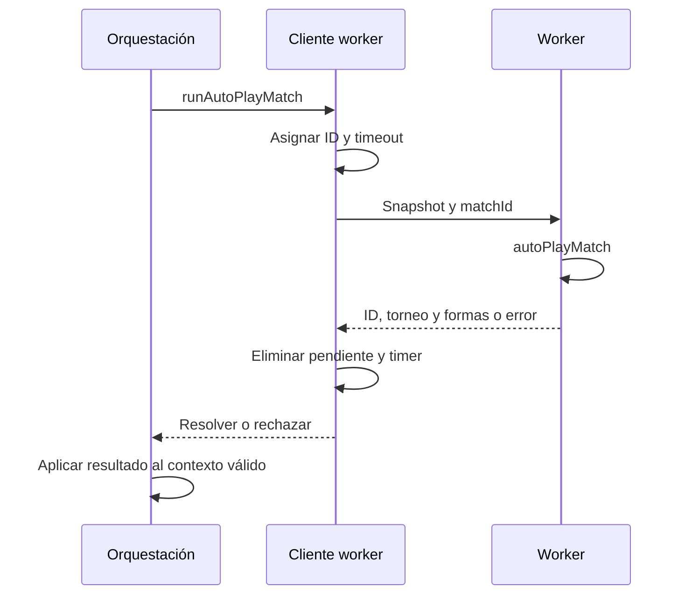

# Interacción, navegación y ejecución asíncrona

Esta guía desarrolla la frontera entre componentes React, orquestación Zustand y trabajo fuera del hilo principal. Véanse también el [diseño técnico](technical-design.md) y la [persistencia](persistence-and-recovery.md).

## 1. Responsabilidades de una pantalla

Una pantalla selecciona datos, presenta resultados y llama a acciones existentes. No debe duplicar las reglas de finalización de temporada, atribución histórica o confirmación de guardado. Los controles distintos que representan la misma salida deben reutilizar el callback y sus guardas.

Los estados locales de disclosure, filtro y selección no son automáticamente estado de dominio. Plegar Bulk Simulation no cambia cómo se simula; cambiar una pestaña no altera la propiedad temporal de un movimiento. Persistir cada detalle visual puede aumentar serialización y escrituras sin aportar valor a la partida.

Los selectores deben limitar la suscripción a las ramas necesarias. Buscar jugadores o reconstruir índices de historial en cada render puede convertirse en un coste dominante al crecer una realidad. Conviene construir datos derivados cuando se necesitan y reutilizarlos mientras sus entradas permanezcan iguales.

## 2. Escape como despacho centralizado

`lib/escapeNavigation.ts` mantiene un stack de capas activas. Una capa registra un callback de cierre y una prioridad; gana la prioridad mayor y, en empate, la capa registrada más recientemente.

| Prioridad convencional | Uso |
|---|---|
| 0 | Página |
| 10 | Detalle |
| 100 | Modal |
| 200 | Popup |
| 1000 | Operación bloqueante |

Un listener global evita que varios componentes consuman la misma pulsación de manera independiente. El evento se marca como consumido y se detiene su propagación inmediata. Se ignoran composición de texto y eventos ya gestionados.

La repetición de teclado se consume, pero no vuelve a invocar el cierre. Mantener Esc pulsado no debe cerrar sucesivamente un popup, su modal y la página. Cada nueva pulsación discreta puede cerrar la siguiente capa disponible.

`useEscapeLayer` conserva el callback reciente y registra/desregistra la superficie según su estado. Al cerrar puede devolver el foco al elemento que estaba activo cuando se abrió, si sigue conectado al documento. El foco no es un detalle decorativo: permite continuar usando el teclado desde el contexto anterior.

## 3. Diálogos nativos y anidados

Los elementos HTML `dialog` tienen su propio evento `cancel`. Ese comportamiento debe coordinarse con el stack para no combinar el cierre nativo del navegador con otro cierre independiente de React.

Ejemplo esperado con Backups y confirmación de borrado:

1. Abrir Backups.
2. Abrir la confirmación de borrado de una copia.
3. Pulsar Esc: cerrar solo la confirmación y devolver foco al control de esa copia.
4. Pulsar Esc otra vez: cerrar Backups.
5. La página de temporada debe seguir abierta.

Los modales que representan una acción destructiva no deben convertir Esc en aceptación. Los callbacks existentes de cancelar o volver conservan la semántica del control visible.

## 4. Operaciones bloqueantes

Una transacción en curso no se cancela de forma segura ocultando su overlay. Guardado, restauración, importación o mantenimiento tienen sus propios límites de cancelación. La capa bloqueante consume Esc mientras el flujo no permite salir.

`lib/desktopStorage.ts` separa el estado de cierre nativo de otras operaciones; `lib/operationProgress.ts` describe fases de progreso. La interfaz debe distinguir trabajo pendiente, en ejecución, error y éxito. Una animación o una estimación no confirma un commit.

Salir de temporada usa el flujo de snapshot y flush. Cerrar la ventana usa el lifecycle nativo. Un test del botón de volver no demuestra por sí solo que cerrar el proceso preserve datos.

## 5. Worker de simulación

`lib/sim/bulkSimClient.ts` crea el worker de forma perezosa. Cada petición contiene ID, torneo, encuentro, catálogo de campeones y mapa de forma. El mapa de pendientes relaciona la respuesta con su promesa.

El worker se empaqueta con `scripts/build-bulk-sim-worker.mjs` antes de `dev` y `build`. Su URL es `/workers/bulkSim.worker.js`; no debe editarse el bundle generado manualmente.

El timeout por petición es de 120 segundos. Un crash, mensaje ilegible o timeout termina la instancia y rechaza pendientes. Si no se puede crear un Worker, el cliente ejecuta el motor en el hilo principal mediante una promesa. Esto conserva funcionalidad, pero no la misma fluidez de la interfaz.

El protocolo usa datos serializables; no pueden enviarse componentes, closures o referencias del store. Un error de `postMessage` debe limpiar su pendiente y timer. Una respuesta tardía no debe aplicar estado a una realidad distinta de la que originó la operación.

## 6. Simulación de varios años

Los helpers de `lib/season/bulkYears.ts` determinan el siguiente paso según el estado anual. La orquestación debe conservar identidad de la realidad, puntos de guardado y coherencia de fases. No basta con incrementar el número de año mientras quedan operaciones de mercado o torneos sin resolver.

Desplegar el panel de Bulk Simulation solo controla visibilidad. Las restricciones de operación y los errores deben seguir funcionando aunque el panel se cierre o la pantalla cambie de estado.

La capacidad de respuesta depende tanto del worker como del coste de recibir y aplicar snapshots. Mover el cálculo al worker no elimina serialización, copia de datos ni renders excesivos en el hilo principal.

## 7. Recursos y presentación consistente

Los logos de equipo, región, rol y campeón deben provenir de los sistemas existentes. No conviene mantener un segundo catálogo de alias solo para una vista nueva.

En tablas paralelas, el mismo orden regional reduce búsquedas visuales. Un ranking puede ordenar por valor, pero debe indicar esa métrica. Un icono de región debe representar la región de la fila; un logo junto a una partida representa al ganador de esa partida, no al lado inicial de la serie.

Las vistas históricas muestran cobertura incompleta si falta información. Sustituirla por la plantilla actual produce una interfaz aparentemente completa con atribuciones falsas.

## 8. Pruebas por nivel

| Nivel | Casos |
|---|---|
| Dispatcher puro | Prioridades, empate, repetición, eventos consumidos y composición |
| React/Playwright | Cierre único, foco, filtros, disclosures y textos de guardado |
| Persistencia | Flush, error y reintento sin éxito prematuro |
| WebView instalado | Integración de diálogos, teclado, Tauri y SQLite |
| Worker | Respuesta, crash, timeout, mensaje inválido y limpieza |

Las pruebas E2E usan la exportación estática. Para probar un cambio de aplicación hay que reconstruir `out/`; modificar solo un test no exige reconstruir el producto. Las capturas complementan las aserciones, pero no sustituyen comprobar qué callback o escritura ocurrió.

Fuentes principales: [Escape](../lib/escapeNavigation.ts), [hook](../lib/useEscapeLayer.ts), [worker](../lib/sim/bulkSimClient.ts), [bulk years](../lib/season/bulkYears.ts), [E2E](../e2e/season-ui-navigation.spec.ts).
