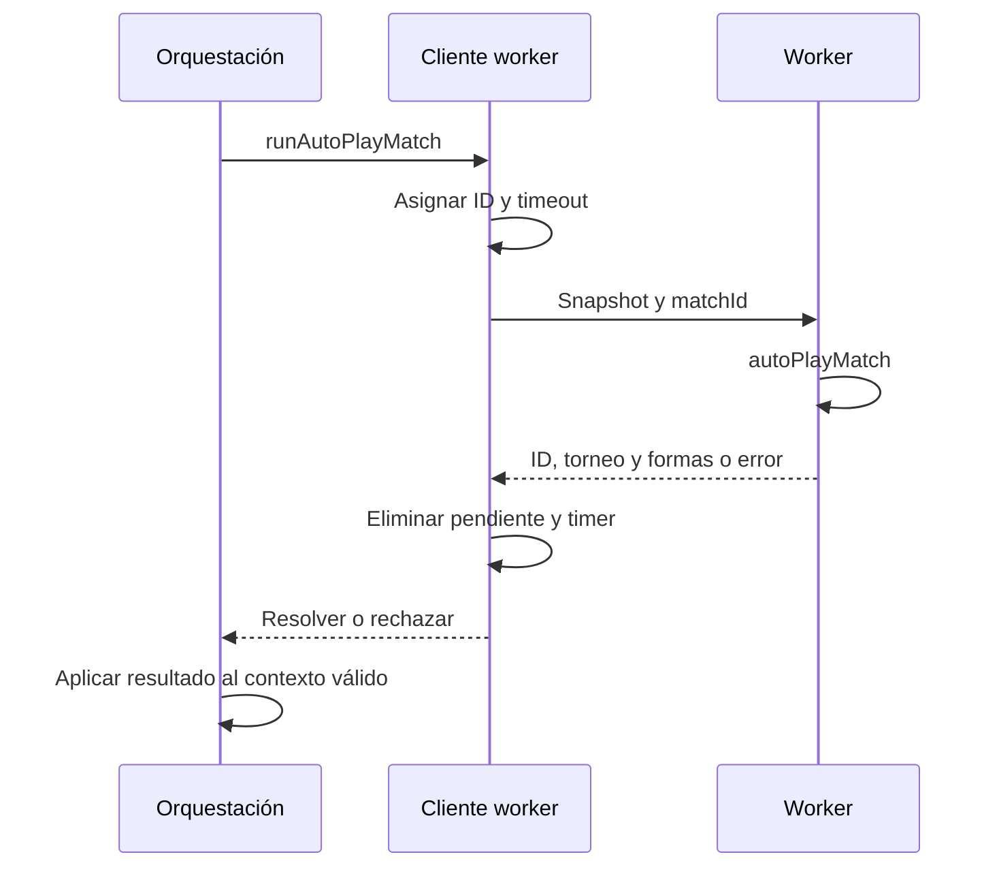

# Interacción, navegación y ejecución asíncrona

Esta guía desarrolla la frontera entre componentes React, orquestación Zustand y trabajo fuera del hilo principal. Véanse también el [diseño técnico](technical-design.md) y la [persistencia](persistence-and-recovery.md).

## 1. Responsabilidades de una pantalla

Una pantalla selecciona datos, presenta resultados y llama a acciones existentes. No debe duplicar las reglas de finalización de temporada, atribución histórica o confirmación de guardado. Los controles distintos que representan la misma salida deben reutilizar el callback y sus guardas.

Los estados locales de disclosure, filtro y selección no son automáticamente estado de dominio. Plegar Bulk Simulation no cambia cómo se simula; cambiar una pestaña no altera la propiedad temporal de un movimiento. Persistir cada detalle visual puede aumentar serialización y escrituras sin aportar valor a la partida.

Los selectores deben limitar la suscripción a las ramas necesarias. Buscar jugadores o reconstruir índices de historial en cada render puede convertirse en un coste dominante al crecer una realidad. Conviene construir datos derivados cuando se necesitan y reutilizarlos mientras sus entradas permanezcan iguales.

## 2. Escape como despacho centralizado

`lib/escapeNavigation.ts` mantiene un stack de capas activas. Una capa registra un callback de cierre y una prioridad; gana la prioridad mayor y, en empate, la capa registrada más recientemente.

| Prioridad convencional | Uso |
|---|---|
| 0 | Página |
| 10 | Detalle |
| 100 | Modal |
| 200 | Popup |
| 1000 | Operación bloqueante |

Un listener global evita que varios componentes consuman la misma pulsación de manera independiente. El evento se marca como consumido y se detiene su propagación inmediata. Se ignoran composición de texto y eventos ya gestionados.

La repetición de teclado se consume, pero no vuelve a invocar el cierre. Mantener Esc pulsado no debe cerrar sucesivamente un popup, su modal y la página. Cada nueva pulsación discreta puede cerrar la siguiente capa disponible.

`useEscapeLayer` conserva el callback reciente y registra/desregistra la superficie según su estado. Al cerrar puede devolver el foco al elemento que estaba activo cuando se abrió, si sigue conectado al documento. El foco no es un detalle decorativo: permite continuar usando el teclado desde el contexto anterior.

## 3. Diálogos nativos y anidados

Los elementos HTML `dialog` tienen su propio evento `cancel`. Ese comportamiento debe coordinarse con el stack para no combinar el cierre nativo del navegador con otro cierre independiente de React.

Ejemplo esperado con Backups y confirmación de borrado:

1. Abrir Backups.
2. Abrir la confirmación de borrado de una copia.
3. Pulsar Esc: cerrar solo la confirmación y devolver foco al control de esa copia.
4. Pulsar Esc otra vez: cerrar Backups.
5. La página de temporada debe seguir abierta.

Los modales que representan una acción destructiva no deben convertir Esc en aceptación. Los callbacks existentes de cancelar o volver conservan la semántica del control visible.

## 4. Operaciones bloqueantes

Una transacción en curso no se cancela de forma segura ocultando su overlay. Guardado, restauración, importación o mantenimiento tienen sus propios límites de cancelación. La capa bloqueante consume Esc mientras el flujo no permite salir.

`lib/desktopStorage.ts` separa el estado de cierre nativo de otras operaciones; `lib/operationProgress.ts` describe fases de progreso. La interfaz debe distinguir trabajo pendiente, en ejecución, error y éxito. Una animación o una estimación no confirma un commit.

Salir de temporada usa el flujo de snapshot y flush. Cerrar la ventana usa el lifecycle nativo. Un test del botón de volver no demuestra por sí solo que cerrar el proceso preserve datos.

## 5. Worker de simulación

`lib/sim/bulkSimClient.ts` crea el worker de forma perezosa. Cada petición contiene ID, torneo, encuentro, catálogo de campeones y mapa de forma. El mapa de pendientes relaciona la respuesta con su promesa.

El worker se empaqueta con `scripts/build-bulk-sim-worker.mjs` antes de `dev` y `build`. Su URL es `/workers/bulkSim.worker.js`; no debe editarse el bundle generado manualmente.

El timeout por petición es de 120 segundos. Un crash, mensaje ilegible o timeout termina la instancia y rechaza pendientes. Si no se puede crear un Worker, el cliente ejecuta el motor en el hilo principal mediante una promesa. Esto conserva funcionalidad, pero no la misma fluidez de la interfaz.

El protocolo usa datos serializables; no pueden enviarse componentes, closures o referencias del store. Un error de `postMessage` debe limpiar su pendiente y timer. Una respuesta tardía no debe aplicar estado a una realidad distinta de la que originó la operación.

## 6. Simulación de varios años

Los helpers de `lib/season/bulkYears.ts` determinan el siguiente paso según el estado anual. La orquestación debe conservar identidad de la realidad, puntos de guardado y coherencia de fases. No basta con incrementar el número de año mientras quedan operaciones de mercado o torneos sin resolver.

Desplegar el panel de Bulk Simulation solo controla visibilidad. Las restricciones de operación y los errores deben seguir funcionando aunque el panel se cierre o la pantalla cambie de estado.

La capacidad de respuesta depende tanto del worker como del coste de recibir y aplicar snapshots. Mover el cálculo al worker no elimina serialización, copia de datos ni renders excesivos en el hilo principal.

## 7. Recursos y presentación consistente

Los logos de equipo, región, rol y campeón deben provenir de los sistemas existentes. No conviene mantener un segundo catálogo de alias solo para una vista nueva.

En tablas paralelas, el mismo orden regional reduce búsquedas visuales. Un ranking puede ordenar por valor, pero debe indicar esa métrica. Un icono de región debe representar la región de la fila; un logo junto a una partida representa al ganador de esa partida, no al lado inicial de la serie.

Las vistas históricas muestran cobertura incompleta si falta información. Sustituirla por la plantilla actual produce una interfaz aparentemente completa con atribuciones falsas.

## 8. Pruebas por nivel

| Nivel | Casos |
|---|---|
| Dispatcher puro | Prioridades, empate, repetición, eventos consumidos y composición |
| React/Playwright | Cierre único, foco, filtros, disclosures y textos de guardado |
| Persistencia | Flush, error y reintento sin éxito prematuro |
| WebView instalado | Integración de diálogos, teclado, Tauri y SQLite |
| Worker | Respuesta, crash, timeout, mensaje inválido y limpieza |

Las pruebas E2E usan la exportación estática. Para probar un cambio de aplicación hay que reconstruir `out/`; modificar solo un test no exige reconstruir el producto. Las capturas complementan las aserciones, pero no sustituyen comprobar qué callback o escritura ocurrió.

Fuentes principales: [Escape](../lib/escapeNavigation.ts), [hook](../lib/useEscapeLayer.ts), [worker](../lib/sim/bulkSimClient.ts), [bulk years](../lib/season/bulkYears.ts), [E2E](../e2e/season-ui-navigation.spec.ts).

## Historial de mercado

La pestaña **Roster Moves** del Hall está disponible también para realidades sin temporadas archivadas. Usa el selector de realidad existente y muestra los movimientos del año en curso junto con los del archivo. Al cambiar de fuente reinicia filtros y paginación, sin activar otra realidad.

El orden inicial es **Newest first**, con opción **Oldest first**. Los filtros incluyen año, ventana, equipo, región, rol, tipo de movimiento, estado y búsqueda por nombre del jugador o del jugador reemplazado. Un equipo o región puede coincidir con cualquiera de los extremos del movimiento. Las regiones usan sus logos; las filas reutilizan los iconos de rol y equipo y presentan badges de Main roster, Academy, Free Agent, Rookie, Retired o Unknown.

The list paginates in groups of 50 with the shared Hall pager chrome (gold Previous/Next controls, chevrons and an absolute `N-M of total` range). Controls appear both above and below the movement list so paging stays reachable without a sticky overlay; changing page resets neither filters nor sort. Incomplete legacy coverage, empty logs and filters without matches remain distinct states. All Hall tabs share the selected reality history: `loadHallRealityHistory` drains pending writes, reads the complete archive, drains writes again and installs it only if the request and target reality are still current. Only then is history marked loaded for persistence. Browsing does not activate the reality or load its season body. Roster Moves separately reads an absent season body for current-year news. Failed reads expose Retry and never install an empty placeholder.

El filtro `Windows` del Hall incluye siempre `Post Winter Split`, `Post Spring Split` y `Post Summer Split`, separados de `Post First Stand`, `Post MSI` y `Offseason`. Las etiquetas de los splits corresponden a las ventanas previas al internacional; solo cambia su nombre visible, conservando los identificadores de origen existentes y su orden cronológico.

### Presentación del mercado y navegación

Los movimientos usan filas compactas con separadores, rol del jugador, origen, destino y badges. Año, ventana, equipo, tipo, estado y orden reutilizan `PlaygroundSelect`: mismo desplegable, foco, flechas, selección y Escape. El selector de equipos incluye logos. Regiones y posiciones usan grupos de botones con sus logos, texto y `aria-pressed`, permitiendo varias selecciones. Dentro de cada grupo se aplica OR; entre grupos y el resto de filtros se aplica AND. Sin botones seleccionados no se restringe ese grupo, y «All» lo restablece. Cambiar regiones limpia el equipo seleccionado y cualquier filtro vuelve a la primera página.

El año del movimiento enlaza con `goToSeasonInTimeline` cuando existe una entrada archivada de esa temporada. Un año desconocido o una temporada aún sin entrada no genera un enlace falso. Los nombres usan `PlayerNameLink`; las cards conservan el contexto de temporada y pueden usar el jugador congelado del snapshot.

La card de equipo de un movimiento incorpora `Before` / `After`, con `After` inicialmente seleccionado. Esos botones no abren el perfil del equipo ni cierran la card. La card muestra el roster principal y la academia congelados, sin atribuirle estadísticas actuales. El comportamiento de hover continúa siendo propio de Desktop; las pruebas de navegador habilitan esa rama de UI después de hidratar fixtures y no prueban IPC nativo.

Los movimientos nuevos se capturan también durante una temporada en curso. No es necesario comenzar otra temporada. Los archivos anteriores sin procedencia conservan el año desconocido; una marca `Offseason` antigua no basta para inventar su año.

Roster-move team cards show both main and academy rosters for the selected Before/After snapshot. An unknown academy snapshot is distinct from an empty academy. Team filter icons resolve the bundled team catalogue when saved rows have no explicit logo URL. Retirement rows display prior status, age and recorded Academy/Free Agent year counts; unavailable legacy fields remain explicitly unknown. The year filter includes known archive years even if they have no recorded movements.

Records & Dynasties uses 20-row pages inside long boards. Previous/Next controls expose the complete ranking with absolute ranks, so large realities do not mount thousands of invisible cards at once. The same pager chrome (`HallPager` / `RecordRows`) also pages Best Rosters (10 per page, after the optional Top 10/25/All cap), Search results (40 per page; there is no silent 200-row display cut-off — every matching result remains reachable) and Compare pick lists for both players and teams (20 per column). Narrow Hall columns (Search sidebar and Compare pickers) use a compact chevron-only pager so the range label is not crushed beside full Previous/Next text; the Search pager sits below the scrollable result list rather than inside it. Pagination only bounds mounted DOM nodes; underlying careers, titles and archives stay complete. Roster Moves adds a player-tier selector and tier badges beside names, removes the Preseason option and retained-player category, and includes paired demotions with recorded evidence. Snapshot team cards show average main-roster tier and stars for whichever Before/After view is selected. Live player-search suggestion team labels align their icon and text vertically with the suggestion row.

Records pagination buttons use bordered gold controls, directional chevrons and explicit hover/focus/disabled states. The Before/After strength indicator shows five filled/dimmed stars with an accessible rating label; it uses the shared half-step deriveStar result. A 4.5 rating displays four complete stars, a half-filled fifth star and an accessible numeric label. Season and tournament setup use a keyboard-accessible range from 1 to 5 in increments of 0.5.

Timeline → By Season keeps a scrollable season list beside the selected résumé. The list scrollport pads its edges so card borders are not clipped when only one year is archived or when the list is shorter than the viewport height.

## Consistent typography, Swiss strength and rookie filters

The application uses [one typography contract](typography.md): Inter for interface text and data, Cinzel only for the DraftSim wordmark, and monospace only for technical import/export text. This also covers form controls and chart labels; the previous display utility now means semibold Inter.

Swiss pairing rows display both teams' graphical stars directly below their names, alongside their pre-round W-L record. `TeamStars` and `teamStarRating` preserve half steps and roster authority, matching other bracket cards. Unassigned/TBD slots do not receive invented strength.

Season Mode's Rookie Class starts collapsed. A full-width emerald Show/Hide control discloses the panel; filters and rows appear only after the user expands it. Role toggle buttons combine multiple selected roles with OR; role selection combines with region/team and Your org/Rest of league scope using AND. All roles clears only the role selection. Main and academy rookies use the same role predicate, and counts plus empty-state guidance follow the active filters. Filters are presentation state and do not change saved players or simulation rules.

## Tournament presentation and matchday context (2026-09-21)

Tournament Momentum, Team Champion Pools, Notable Games, individual awards, MVP, summary and champion banners display team artwork and tournament seeds. Known region snapshots add the region logo; awards retain role icons. Meta Shifts displays champion artwork, role and previous/new tier badges. Seeds describe entry into this tournament, not the current standings. Clickable pool/replay cards contain non-interactive identity markup, avoiding nested buttons.

Latest Matchday places context badges on a separate line above each score, leaving space for team names. Each match records its stage and round before simulation: Regular Split/Matchday, Group Stage/group, Swiss Stage/round/pre-round record, or Playoffs/Knockout and bracket. Single-elimination paths name Round of 32, Round of 16, Quarterfinals, Semifinals and Final from advancement links. Double/triple elimination retain Winners, Losers, Last-Chance, Consolation and Grand Final/Reset; stepladders keep their own label. Play-In is an additional badge, independent of the underlying format. Different Swiss records are shown as `2-1 vs 1-2`, not collapsed into an invented common pool.

Recorded zero-death KDA displays **Perfect KDA**, including an explicit 0/0/0. Missing recap statistics remain unavailable. A partially recorded series states how many games its KDA covers. Positive-death ratios still use total kills plus assists divided by total deaths; ratings and award selection are unchanged.

Offseason leaders and Season Recap reuse team/region artwork and player role icons. Most MVPs and Rookie of the Year use aligned three-row cards (player line with count/rating, team+region, then KDA or titles). AI Difficulty and Follow Team occupy a separate responsive control row, so season-option wrapping cannot misalign their labels or inputs.

### Card interactions and alignment follow-up

Latest Matchday centers its stage/round/record badges above each result. Swiss slots anchor their identity to the outer edge of their respective column regardless of name length. Notable Games aligns and centers the `Won by` label with the winning team's identity. The live World Champion banner places Golden Road on a separate centered row with explicit spacing.

Momentum's On fire/Slumping rows show the actual tournament roster player's name through `PlayerNameLink`, next to the role icon, with team identity and seed below. Team identities across tournament panels open existing desktop cards, using the tournament roster rather than a replacement signed later. Standalone teams can open cards without a region; no regional identity is fabricated. Empty champion pools do not suppress otherwise valid player cards.

Franchise Timeline team names toggle the row detail instead of navigating directly. Both the name and logo expose a team card; clicking that card opens the Hall team profile. The detail is anchored near the left edge of the matrix, including after horizontal scrolling. Moving focus from a team-name trigger into its card preserves the card long enough to handle profile navigation.

### Tournament summary readability

Notable Games uses one card per category with a prominent duration or lowest winner win probability, game number, stacked team identities, a centered winner line and an explicit View replay button. Team cards remain separate from the replay action. Missing observations show an unavailable state. Game selection remains side-aware when teams switch sides within a series.

Momentum groups win streaks, On fire and Slumping into three desktop columns that stack on narrow windows. Rows retain team/player cards, seeds and role icons. Streaks state the consecutive series count; player form shows its signed value on the existing −1 to +1 scale, not a win probability. Existing eligibility and sorting remain unchanged.

Meta Shifts groups the role icon and before/after tiers in one vertically centered inline row next to champion identity, allowing wrapping on narrow screens. Swiss pairing names are neutral before play, green for the winner and red for the loser after a result. Accessible result labels and tooltips identify both outcomes. There are no winner badges, backgrounds or underlines. This adds no layout space and does not displace names, records or stars. Record-group colors still describe winning/even/losing records. Simulation sides and results are unchanged.

Notable Games also includes Most Kills (combined observed kills), Closest Kill Score (absolute final kill difference, not a victory margin), Biggest Momentum Swing (largest absolute single-event probability change in percentage points), and Largest Gold Lead (peak absolute gold difference recorded in the timeline, either side, even if that side later lost). Each opens its originating game replay. Missing data stays unavailable; multiple categories can legitimately select the same game.

Biggest Momentum Swing explains `pp` inline as percentage points: a change from 40% to 65% is 25 pp, not a relative increase of 25%.

Latest Matchday competition headings pair their text with bundled league artwork for domestic splits and event artwork for internationals (First Stand, MSI, Worlds and Global Cup). Event identity is captured from the simulated phase before advancement, so a completed qualifier keeps its event logo and an international never borrows its first participant’s region logo.

Latest Matchday result tags, including Reverse Sweep, share the centered, wrapping phase/round badge row above the score. They do not consume space in the team/score row.

### Match replay and live event identity

Replay Key Events, live Key Moments/event logs, replay damage rows and game MVP details reuse the match's team artwork, recorded player names and role icons. Event descriptions substitute only unambiguous whole champion/player names; legacy descriptions remain readable when no identity is available. Side-swapped games use their own blue/red mapping. Damage remains a KDA-based estimate, not measured damage. Team logos also identify live contribution rows and event kill totals.

First Stand play-in/main-event preview cards constrain their grid width; horizontal bracket scrollers reserve space at the trailing edge so the rightmost border stays reachable.

Season tournament MVP panels now use the same selectors as reality summaries: domestic splits use the champion's finals MVP, and internationals use the champion team's whole-event MVP. Legacy tournament views recover scope only from their owning season. Standalone tournaments retain their separate tournament-performance award. No archived award records are rewritten.

### Replay alignment and season card frames

Damage Dealt and Game MVP use a shared vertical center for player labels and team marks, including wrapping MVP rows. Season tournament cards clip overflowing content and paint an inset frame above it, with the same border color in normal/hover states as the surrounding card. These cards no longer use `content-visibility: auto`; their small per-phase grid keeps an explicit frame visible, including the rightmost First Stand and Worlds main-event cards. Other dashboard visibility optimizations remain in place.

Regression checks compare logo/text centers and inspect play-in/main-event cards at 1024 and 1440 px in both normal and hover states. The main-event fixture renders an elimination bracket rather than simply renaming a domestic standings table.
