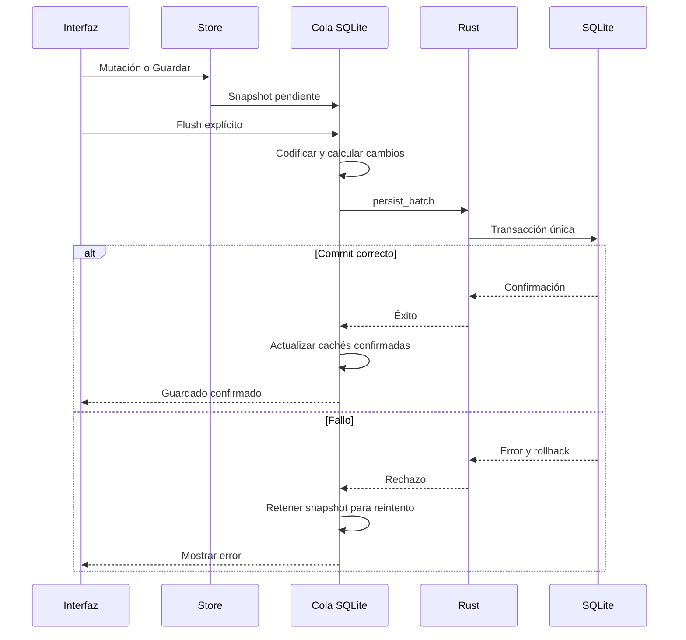

# Persistencia, guardado y recuperación

Esta guía describe los contratos de datos de DraftSim. Es complementaria al [diseño técnico](technical-design.md) y al [esquema SQLite](desktop-sqlite-storage.md). Los ejemplos de diagnóstico deben realizarse con fixtures desechables, nunca sobre partidas personales.

## 1. Dos entornos de almacenamiento

Desktop usa SQLite en `%APPDATA%\app.draftsim.desktop\draftsim.db`. El navegador usa su almacenamiento web. Abrir el frontend en un navegador no equivale a abrir la base de datos de la aplicación de escritorio.

La identidad `app.draftsim.desktop` se conserva entre versiones. Cambiarla puede hacer que una instalación lea otra carpeta y parezca vacía. No debe utilizarse un cambio de identificador como solución a una migración o a un guardado lento.

Hay cuatro estados distintos: modificación en memoria, snapshot pendiente, escritura en vuelo y escritura confirmada. Mostrar «Saved» al completar el primero es incorrecto. El guardado manual y las salidas que requieren persistencia deben esperar el flush correspondiente.

## 2. Modelo físico

`lib/desktopSqliteSchema.ts` define `DATABASE_VERSION = 8` para SQLite y `PERSIST_VERSION = 7` para el envelope de Zustand. La versión del formato persistido es independiente de la versión comercial de la aplicación.

| Tabla | Clave | Datos |
|---|---|---|
| `schema_meta` | `key` | Flags de migración y metadatos |
| `global_state` | `store_key` | Ajustes, manifiesto de fragmentos y fecha |
| `global_fragments` | `(store_key, fragment_key)` | Agregados competitivos independientes |
| `reality_catalog` | `reality_id` | Resumen de estado del año para el selector |
| `realities` | `id` | Nombre, año, temporada compacta y actualización |
| `reality_history` | `(reality_id, entry_id)` | Entrada anual y orden |
| `meta_config` | `config_key` | Ajustes del meta |

El historial tiene relación con la realidad y un índice por realidad y orden. No se normaliza cada partida o jugador en una tabla independiente: se separan agregados grandes y se preservan estructuras complejas dentro de JSON.

El blob global conserva `realities: []` como placeholder. Los cuerpos de las realidades se guardan en filas propias. El espejo de temporada activa vive en un fragmento separado; modificar ajustes no lo vuelve a serializar.

## 3. Hidratación y protección del arranque

La aplicación nace con valores de memoria por defecto y necesita cargar el estado persistido. La puerta de escritura impide que esos valores iniciales sobrescriban la base de datos antes de completar la hidratación.

Un error de lectura no equivale a una partida nueva. No se debe activar automáticamente la escritura del estado vacío para «desbloquear» la UI. El flujo debe conservar el error y permitir recuperación.

La carga de historiales es perezosa para realidades inactivas. `history: []` puede significar «no cargado», no «borrado». El registro de historiales cargados forma parte del contrato de persistencia. Las escrituras no deben sustituir filas históricas de realidades cuyo historial no está en memoria.

Antes de exportar una realidad completa o trabajar con su Hall puede ser necesario cargar sus filas históricas. Validar el JSON exportado no detecta que faltan años si se construyó sobre un array perezoso vacío.

### Carga lenta y restauración durante la recuperación

El límite de 45 segundos abre la pantalla de recuperación y mantiene las escrituras bloqueadas; no acredita corrupción de la copia. El diagnóstico incluye el último paso de carga (conexión, esquema, copia preventiva de actualización, fragmentos, realidad activa o preparación de recaps), sin nombres ni rutas personales. El mensaje de consola ya no describe este estado como una puerta de escritura abierta.

Restaurar incrementa la generación de lectura y mantiene una pausa independiente del resultado de hidratación. Una lectura asíncrona anterior se rechaza antes de que Zustand pueda instalarla. La finalización tardía de una hidratación no levanta la pausa de restauración; al fallar una carga, cancelar la restauración tampoco habilita escrituras por accidente.

La validación nativa de copias comprueba JSON y tipo objeto dentro de SQLite para estado, temporadas e historiales. Los fragmentos admiten cualquier valor JSON válido, pero conservan la comprobación de manifiesto y referencias. Se mantienen `integrity_check`, claves foráneas, validación de versiones y retención de copias; los grandes árboles competitivos ya no se materializan como `serde_json::Value` para validarlos. Esto reduce el coste de la copia preventiva de formato 8 y del paso «Preserve current data» al restaurar.

Comprobación local en perfil debug con un fixture sintético de 32 MB: lectura y construcción del árbol Rust, 1.920 ms; validación de JSON/tipo dentro de SQLite, 91 ms. Es una medida de esa fase, no del tiempo total de restauración ni de una partida personal. Las pruebas cubren JSON malformado, valores de tipo incorrecto, fragmentos ausentes, WAL, rollback y lecturas tardías durante recuperación.

## 4. Cola de escritura

`lib/desktopSqliteStorage.ts` recibe snapshots del middleware de Zustand. Agrupa cambios con un debounce de 500 ms y mantiene una operación en vuelo. El flush drena también los snapshots que llegan mientras se espera una escritura anterior.

Cuando falla una escritura, el snapshot se retiene para reintento si no existe uno más reciente. Nunca debe sustituirse el estado pendiente nuevo por el antiguo que falló. Cancelar un timer tampoco cancela una operación SQL que ya está en vuelo.

El flush es una frontera de coordinación, no un simple `setTimeout`. Salir, hacer un backup o restaurar debe tratar explícitamente la cola y los errores según el flujo correspondiente.

## 5. Atomicidad nativa

`src-tauri/src/storage.rs` obtiene una transacción del pool SQL, ejecuta el lote sobre esa misma transacción y confirma al final. Si una sentencia falla, las anteriores no deben quedar aplicadas parcialmente.

Enviar `BEGIN` y después varias llamadas independientes a un pool no garantiza que utilicen la misma conexión. El comando `persist_batch` concentra esa responsabilidad en Rust y recibe sentencias con bindings escalares.

El comando resuelve la base de datos registrada de DraftSim y comprueba la ventana llamante. La seguridad depende además de las capacidades de Tauri y de CSP; una comprobación de nombre de ventana no sustituye esas otras barreras.

SQLite se configura con WAL y `synchronous=NORMAL`. Esta elección mejora concurrencia y coste, pero no es una promesa absoluta frente a fallos de energía o hardware. Commit, integridad y respaldo cubren problemas diferentes.

## 6. Serialización y rendimiento

La compactación de recaps reduce el tamaño persistido. Las cachés por referencia evitan recodificar temporadas o realidades intactas. Deben actualizarse después del commit, no antes: de lo contrario, un reintento puede omitir datos que nunca se escribieron.

La comparación del estado global ignora el placeholder vacío de realidades. Recrear ese array no debe obligar por sí solo a serializar todo el estado global.

El flujo de salida de temporada crea el snapshot y usa la cola normal. Hacer antes un upsert independiente puede invalidar cachés y provocar que el flush reescriba otras realidades e historiales. La corrección debe preservar tanto el estado activo como la ausencia de trabajo innecesario sobre slots ajenos.

Costes que conviene medir por separado:

1. Construcción y actualización del estado en memoria.
2. Codificación compacta y serialización JSON.
3. Espera detrás de operaciones anteriores.
4. IPC y ejecución SQL.
5. Actualización de cachés y confirmación visual.

Un guardado de un minuto no permite atribuir el problema a SQLite sin distinguir esas fases. Un warning de Meraki o de un gráfico no es evidencia suficiente de causalidad.

## 7. Cierre, salida y mantenimiento

Salir de una temporada y cerrar la ventana nativa son operaciones diferentes. Ambas pueden requerir persistencia, pero deben conservar sus respectivas confirmaciones y guardas. Una capa bloqueante evita que Esc cierre pantallas mientras se completa una operación que no puede cancelarse arbitrariamente.

El botón Guardar debe mostrar estado ocupado y confirmar éxito después de esperar el flush. Si falla, debe ofrecer reintento o exportación y no mostrar una confirmación anterior como si perteneciera al intento nuevo.

`VACUUM` es mantenimiento explícito, no una operación que deba ejecutarse en cada cierre. Tras borrar datos, el espacio reutilizable de SQLite y el tamaño físico del archivo pueden diferir; una compactación puede recuperar espacio, pero tiene coste propio.

## 8. Backups y restauración

Un backup nativo captura la base de datos para recuperación. Una exportación portable de realidad describe un agregado para compartir o importar. Exportar un slot no equivale a respaldar todos los ajustes y realidades de la instalación.

`src-tauri/src/backups.rs` usa `VACUUM INTO` para obtener un snapshot coherente. Copiar solo `draftsim.db` con WAL activo puede omitir datos existentes en archivos auxiliares. Debe utilizarse el flujo de backup implementado.

La restauración coordina archivos temporales, base activa y recuperación de interrupciones. `recover_interrupted_restore` se ejecuta al arrancar. El frontend debe impedir que una cola anterior vuelva a escribir sobre la base restaurada durante la recarga.

Crear o borrar una copia, desactivar un destino externo y restaurar son acciones distintas. Desactivar un destino no debe interpretarse como autorización para borrar todas las copias existentes en él.

## 9. Migración legado

El adaptador detecta el almacenamiento JSON antiguo y lo migra a las tablas correspondientes. El flujo conserva originales como respaldo y registra metadatos de migración. Los fallos deben dejar una vía de reintento y no presentarse como una partida vacía migrada correctamente.

Para comprobar migración, verificar tanto metadatos como contenido: realidad, año, cantidad de equipos, historial e integridad. Reabrir una vez no demuestra que todos los años se hayan transferido.

Los scripts de instalación rechazan estaciones personales y carpetas de aplicación ya existentes. Sus fixtures solo se usan en runners desechables. No se debe desactivar esa guarda para acelerar una prueba local sobre AppData real.

## 10. Importación y límites

`lib/importValidation.ts` valida estructura y contenido antes de mutar el estado. `lib/realityShare.ts` admite JSON y códigos `REAL1:` comprimidos. La salida descomprimida de una realidad tiene un límite de 512 MiB y un límite específico de nodos.

La importación de libros de cálculo inspecciona el ZIP antes de materializar celdas. `lib/zipImportLimits.ts` limita la entrada a 64 MiB, las entradas ZIP a 10.000 y el volumen descomprimido a 128 MiB por defecto. Cuenta bytes realmente inflados y no confía solo en tamaños declarados.

Estos límites son techos de aceptación, no garantías de memoria o velocidad. Un archivo válido grande sigue siendo costoso. La revisión debe finalizar antes de reemplazar el estado activo.

## 11. Matriz de fallos y recuperación

| Fallo | Comportamiento requerido |
|---|---|
| Lectura inicial fallida | No sobrescribir con valores iniciales |
| Sentencia intermedia fallida | Rollback del lote completo |
| Escritura fallida con snapshot nuevo pendiente | Conservar el nuevo |
| Historial no cargado | No interpretarlo como borrado |
| Backup con WAL activo | Snapshot coherente mediante flujo nativo |
| Restore interrumpido | Recuperación de arranque, sin sobrescritura de cola vieja |
| Importación inválida | Rechazar antes de reemplazar estado |
| Guardado manual fallido | No confirmar éxito; permitir reintento |

Tests principales: `desktopSqlite.test.ts`, `desktopSqliteStorage.test.ts`, `desktopStorage.flush.test.ts`, `persistenceLifecycle.test.ts`, `seasonExitPersistence.test.ts`, pruebas nativas de `storage.rs` y `backups.rs`, y pruebas de instalación/reapertura.

## 12. Formato 8, carga de cuerpos y diagnósticos

Antes del primer cambio de una base SQLite 7 existente, `loadDatabase` solicita una copia nativa llamada **Before storage format 8**. Si falla, la apertura falla sin habilitar escrituras. La creación aditiva de tablas mantiene el marcador 7; el manifiesto, sus fragmentos y el marcador 8 se confirman juntos en la primera transacción de guardado. El envelope Zustand sigue en 7 porque no es la versión del esquema físico.

Un manifiesto con claves desconocidas, duplicadas, fragmentos ausentes o JSON corrupto provoca error de carga. La verificación profunda de copias también comprueba las referencias; listar copias solo lee metadatos. Las versiones anteriores no pueden leer el formato 8: para volver atrás hay que recuperar la copia anterior a la migración. Esa copia no incluye cambios posteriores.

`SavedReality.season === null` significa cuerpo aún no cargado, nunca temporada vacía. El arranque consulta solo el cuerpo de la realidad activa y los resúmenes del resto. Una fila antigua sin catálogo obtiene el estado mediante extracción JSON en SQLite; no transfiere ese blob al frontend. Al guardar un cuerpo se actualiza su catálogo en la misma transacción.

El cambio de realidad carga temporada e historial, drena escrituras pendientes y comprueba que la solicitud sigue vigente antes de activarla. Una respuesta tardía no puede sustituir otra realidad abierta después. Exportar una realidad inactiva carga su contenido sin activarla; si alguna lectura falla, rechaza una exportación incompleta. Guardar otra realidad o los ajustes no borra cuerpos ausentes de memoria.

El guardado del año en curso no depende de su archivo anual: partidos y plantillas actuales viven en `realities.season_json` y en el fragmento activo, aunque el Hall esté vacío. Tras abrir una temporada queda en memoria hasta finalizar la sesión; esta implementación no aplica una política de expulsión.

La sección de diagnósticos en Backups habilita métricas solo durante la sesión. `global-encode`, `season-encode`, `history-encode`, `plan`, `commit` y `flush` son fases anidadas: sus tiempos no deben sumarse como si fueran independientes. `commit` incluye IPC y transacción. El buffer de 200 registros puede descartar muestras antiguas en operaciones grandes. Desactivar o limpiar invalida también mediciones en vuelo. Los JSON exportados contienen únicamente métricas; no incluyen datos competitivos ni rutas.

### Hall history load flags and dev reloads

Lazy dormant histories are represented by empty placeholders. Populated history arrays are complete archives and must be persisted even when a module reload has lost its transient loaded-ID set. The Hall loader preserves populated store history instead of replacing it with a possibly empty/older DB read. Explicitly unloaded empty arrays remain protected from delete reconciliation. A regression clears load flags between five real rollovers and SQLite save/load boundaries.

Concurrent requests for the same reality object share one read and write-drain sequence. A fully read SQLite history can be registered as already synchronized when it is installed after older queued snapshots are drained. This avoids re-encoding/upserting unchanged history solely because the Hall was opened. Later immutable edits still trigger normal transactional reconciliation; failed reads or changed/cancelled targets are not installed. The unchanged-history regression verifies zero write statements, and separately checks that a later deletion is persisted.
