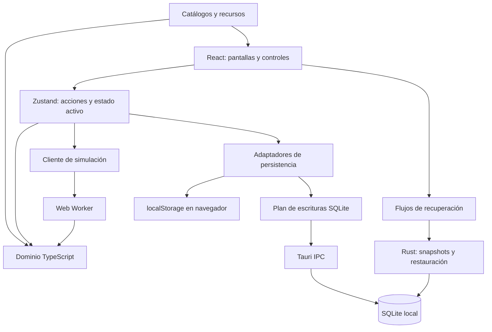
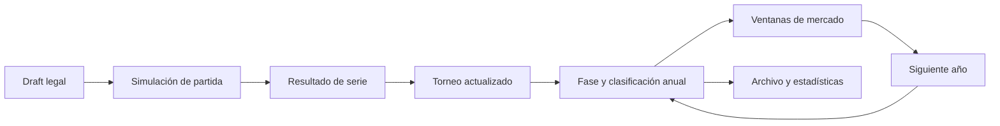

# Diseño técnico de DraftSim

Referencia: código de preparación de 0.6.0, septiembre de 2026. Este documento describe arquitectura y decisiones; las guías de [dominio](domain-contracts.md), [persistencia](persistence-and-recovery.md), [interacción](interaction-and-execution.md) y [desarrollo](development-and-release.md) detallan los contratos de cada subsistema.

## 1. Objetivo y límites

DraftSim es un simulador local de draft y competición inspirado en League of Legends. Combina selección de campeones, resolución de partidas, series, torneos, temporadas y realidades de varios años. El usuario puede intervenir o delegar la simulación.

El objetivo es que composición, jugadores, estrategia y calendario tengan consecuencias reconocibles. No se ejecutan todas las reglas del cliente del videojuego ni se reproduce cada parche al detalle. El resultado es un modelo probabilístico con explicaciones y estadísticas que permiten analizar la competición.

El instalador contiene un frontend estático. No necesita un servidor Next.js en producción ni un backend remoto para guardar partidas. Algunas imágenes y actualizaciones de catálogo pueden requerir red: aplicación local no significa que todos los recursos externos estén disponibles offline.

La arquitectura descrita no incluye autenticación multiusuario, sincronización automática entre dispositivos ni un servidor de competición. Exportar una realidad no equivale a disponer de colaboración concurrente.

## 2. Componentes y fronteras

| Capa | Ubicación | Responsabilidad y restricción |
|---|---|---|
| Arranque | `app/`, `next.config.ts` | Cargar y exportar la interfaz; no depender de APIs de servidor en producción |
| Presentación | `components/` | Interacción y visualización; no inventar resultados históricos |
| Orquestación | `store/draftStore.ts`, `store/actions/` | Coordinar mutaciones, operaciones y persistencia |
| Dominio | `lib/draftAI/`, `lib/sim/`, `lib/season/` | Reglas de competición, identidad y evolución |
| Adaptadores | `lib/desktopStorage.ts`, `lib/desktopSqlite*.ts` | Hidratación, colas, codificación y diferencias SQL |
| Nativo | `src-tauri/src/` | Transacciones, archivos, backups y ventana |
| Distribución | `scripts/`, `.github/workflows/` | Validar y publicar artefactos del commit previsto |

Las fronteras fundamentales separan presentación de reglas, memoria de almacenamiento confirmado y JavaScript de operaciones nativas. Una pantalla que muestra una mutación inmediatamente no demuestra que esa mutación haya llegado al disco.

El núcleo de reglas se puede probar sin React. Sin embargo, `lib/` también contiene hooks y adaptadores de navegador: no toda esa carpeta es código puro ni seguro para ejecutar dentro de un worker.

## 3. Plataforma y arranque

El frontend utiliza Next.js 16, React 19, TypeScript, Zustand 5 y Tailwind CSS. Tauri 2 proporciona el shell; Windows renderiza mediante WebView2. SQLite se accede mediante el plugin SQL y comandos propios en Rust para operaciones transaccionales.

`next.config.ts` establece `output: "export"`. El build produce `out/`, referenciado desde `frontendDist` en la configuración Tauri. En desarrollo, Tauri ejecuta `beforeDevCommand` y abre el servidor de `localhost:3000`. Compilación bajo demanda, HMR y peticiones de desarrollo pueden producir tiempos y mensajes que no existen en el instalador.

La identidad nativa es `app.draftsim.desktop`. Cambiarla puede cambiar la ubicación de AppData y hacer parecer que se perdieron partidas. Debe conservarse entre versiones ordinarias. El nombre del ejecutable, el identificador de aplicación y la versión comercial son propiedades distintas.

El catálogo base de campeones está empaquetado. `lib/communityDragon.ts` gestiona consultas complementarias. Un fallo HTTP de Meraki no demuestra un fallo de SQLite: catálogo y persistencia deben diagnosticarse por separado.

## 4. Modelo de datos por agregados

| Agregado | Función |
|---|---|
| Draft | Turnos, elecciones, bloqueos y restricciones de posición |
| Serie | Partidas y resultado acumulado de dos equipos |
| `TournamentState` | Formato, encuentros, clasificación y progreso |
| `SeasonState` | Equipos, calendario, torneos, configuración y evolución anual |
| Realidad | ID, nombre, año, temporada actual e historial |
| `SeasonHistoryEntry` | Snapshot anual para timeline, búsquedas y récords |
| Jugador | Identidad estable, capacidades y trayectoria |
| Evento de plantilla | Snapshot de participantes y procedencia temporal |

`SeasonState.tournaments` es un mapa por ID. `phases` describe el calendario y `phaseIndex` la fase actual. Cada fase referencia sus torneos. La franquicia añade año, envejecimiento, nombres reservados, jugadores inactivos y restricciones del mercado.

Los archivos históricos no deben depender de la plantilla actual para contestar quién jugó o ganó un evento. Los snapshots de fase conservan esa evidencia. Tampoco debe reconstruirse una carrera uniendo únicamente nombres: los IDs estables permiten mantenerla después de fichajes y cambios de rol.

## 5. Flujo competitivo

La IA de draft puntúa candidatos legales según meta, rol, composición, confort y oponente. Dificultad y personalidad ajustan preferencia y muestreo, pero no pueden autorizar picks ilegales. La explicación de una elección debe utilizar las mismas contribuciones que la decisión.

`lib/matchSimulator.ts` coordina los módulos de timeline para líneas, objetivos, peleas y cierre. Las capacidades de plantilla, composición, forma y estrategia influyen en eventos y resultado. Añadir modificadores exige comprobar que no se cuenta dos veces la misma ventaja en distintos niveles.

Los ratings derivados de partidas alimentan premios, estadísticas y decisiones de plantilla. Cambiar su fórmula es una modificación transversal del modelo competitivo, aunque el primer síntoma aparezca en una tabla de UI.

## 6. Aleatoriedad y reproducibilidad

Las funciones que aceptan RNG y los helpers de `lib/rng.ts` permiten escenarios reproducibles. La semilla por sí sola no basta: deben conservarse entradas, catálogo, configuración y orden de consumo del generador. No se garantiza igualdad exacta entre versiones que cambien las reglas.

Las pruebas deterministas detectan regresiones de lógica. Las pruebas estadísticas evalúan distribuciones y equilibrio. Un snapshot estable no demuestra equilibrio competitivo y una distribución razonable no demuestra que una regla concreta sea correcta.

## 7. Estado, identidad e inmutabilidad

Zustand actúa como coordinador. Las vistas deben seleccionar ramas concretas para evitar renders y recálculos por cambios ajenos. Los motores reciben entradas explícitas y devuelven resultados; los efectos de almacenamiento y navegación se coordinan fuera de las reglas puras.

Las cachés de codificación y persistencia utilizan referencias de objetos. Modificar una rama exige una referencia nueva; conservar una rama intacta permite reutilizar trabajo. Mutar en sitio puede ocultar un cambio a la caché, mientras reconstruir todo el árbol en cada acción destruye la optimización.

La ausencia de datos tiene semántica propia. Historial no cargado no es historial borrado; premio no documentado no es premio conocido con valor cero; etiqueta de offseason no es prueba de año de origen.

## 8. Decisiones y compensaciones

| Decisión | Beneficio | Coste o límite |
|---|---|---|
| Frontend estático en Tauri | Distribución sin servidor de aplicación | No admite depender de lógica Next de servidor |
| Motor TypeScript compartido | Reutilización en UI, worker y tests | El fallback síncrono puede bloquear la interfaz |
| SQLite con agregados JSON | Atomicidad y separación del historial | Algunos blobs crecen con la temporada |
| Historial perezoso | Reduce el coste inicial | Necesita metadatos explícitos de carga |
| Cachés por referencia | Reduce codificación y escrituras | Exige inmutabilidad e invalidación correcta |
| Origen explícito y fronteras legado | Propiedad estable para eventos nuevos | Los registros antiguos conservan incertidumbre |
| Dispatcher único de Esc | Una sola capa por pulsación | Todas las superficies deben integrarse |
| Pruebas del instalador | Validan integración nativa | CI más lento y dependiente de WebView2 |

## 9. Evolución implementada en 0.7.0

**Propiedad temporal explícita.** Los productores de noticias y transferencias añaden `origin: { seasonId, year, windowId }`. Los filtros, límites de mercado y archivo conservan la propiedad original al guardar, importar y avanzar de año. Las filas antiguas sin origen siguen usando sus sellos y fronteras de índice; no se inventa información histórica.

**Estado global dividido.** El formato físico SQLite 8 separa ajustes y manifiesto de los agregados competitivos en `global_fragments`. Las referencias intactas evitan recodificar fragmentos. Raíz, fragmentos, realidades e historial modificado entran en la misma transacción nativa. Antes de convertir una base 7 existente se crea una copia coherente recuperable.

**Temporadas inactivas bajo demanda.** Al arrancar, los cuerpos de realidades inactivas quedan como `season: null`, con nombre, año y resumen de estado disponibles. Cambiar de realidad o exportarla carga el cuerpo completo; guardar ajustes conserva las filas descargadas. La temporada actual se guarda aunque no tenga ninguna entrada en el Hall. Las temporadas abiertas permanecen en memoria durante la sesión: no hay expulsión automática.

**Diagnósticos optativos.** Backups incluye controles de instrumentación local, desactivados al arrancar. El buffer conserva hasta 200 muestras de fase, duración, bytes, sentencias y éxito. El commit mide la llamada nativa completa (IPC y transacción), sin aislar sus costes internos. No guarda payloads, nombres, rutas ni mensajes de error. Exportar genera un JSON de métricas; no envía telemetría.

**Caché de CI.** Windows reutiliza dependencias Rust mediante una revisión de `Swatinem/rust-cache` fijada a commit. Toolchain, manifests, lockfile y entorno de compilación participan en sus claves. Se recompila la aplicación y se generan los dos instaladores para el commit evaluado. La prueba instala primero v0.6.0, comprueba la actualización al formato 8 y verifica la copia anterior.

### Medición y límites

`scripts/benchmark-save-pipeline.mts` compara no-op, cambio de ajuste y cambio de temporada con tres realidades, 300 entradas históricas y un split parcialmente simulado. En el fixture medido, cambiar un ajuste pasó de codificar unos 338 KB a 83 bytes; un no-op no emite sentencias. Es una medición de planificación frontend con commit simulado, no una promesa de latencia de disco ni de velocidad para cualquier partida. Guardar una temporada modificada sigue requiriendo codificar su agregado.

## 10. Reglas para extender la arquitectura

Identificar productores, consumidores y representación persistida antes de cambiar una entidad. Una noticia de plantilla afecta generación, digest, archivo, importación y rollover; una métrica puede afectar premios y mercado; una salida de pantalla afecta foco, guardado y cierre nativo.

Los cambios de almacenamiento deben declarar la frontera transaccional y el comportamiento ante fallo. Los cambios históricos deben preferir campos opcionales y normalización conservadora. Las nuevas superficies deben integrar Escape y sus guardas desde el inicio.

Las pruebas deben usar datos desechables representativos: varias realidades, archivos antiguos, historiales extensos y temporadas incompletas. Los planes y comentarios antiguos ayudan a entender decisiones, pero el comportamiento actual se comprueba en código y tests.

### Historial de mercado: ampliación de septiembre de 2026

El Hall dispone de una vista de movimientos por realidad que combina archivo anual y temporada en curso sin activar otra realidad. `marketHistory.ts` normaliza noticias y transferencias, preserva procedencia y ofrece filtrado cronológico. Las ventanas domésticas previas al internacional se muestran como `Post Winter Split`, `Post Spring Split` y `Post Summer Split`; se conservan las claves persistidas existentes.

`marketSnapshots.ts` captura rosters principales y academia antes/después de cambios confirmados. Los snapshots son campos aditivos de cada movimiento, viajan con temporada, archivo e importación, y no requieren migración destructiva de SQLite. La UI usa esos snapshots en una card específica con selector y mantiene una ausencia explícita para datos antiguos. No se recorre ni se reescribe el historial para deducir plantillas pasadas a partir de las actuales. El coste adicional de almacenamiento se limita a los equipos afectados, con hasta cinco jugadores principales por lado y los miembros de academia asociados; no se copian torneos ni recaps.

La interfaz comparte el selector accesible del Hall para los desplegables, usa botones de selección múltiple para regiones y posiciones, incorpora sus logos y enlaza años archivados a la Timeline. Véanse los contratos y límites detallados en [domain-contracts.md](domain-contracts.md) y [interaction-and-execution.md](interaction-and-execution.md).

### Market history: multi-year coverage and retirement evidence

The year selector uses recorded archive years, the current franchise year and movement origins, rather than only years with visible rows. Empty or pre-feature archives therefore remain selectable when their year metadata is known. Archived news may use its explicit archive year when origin metadata is absent; live legacy news never borrows the current year. No missing market events are reconstructed from current rosters.

A regression exercises five real franchise rollovers and SQLite save/load boundaries using a disposable in-memory database, checking every year's Winter and MSI filters. This verifies persistence of recorded news, not recovery of news that an older running dev store never archived. Restarting desktop:dev is necessary when checking changes to initialized Zustand actions; creating a new reality alone may retain old closures through hot reload.

New inactive spells carry optional `inactiveTenure` counters. Each year-end observation increments the player's previous Academy or Free Agent status, independently of the resettable badge clock. Moving between those inactive states preserves counts; returning to a main roster and leaving again starts a new spell. These are observed simulation year-end counts, not exact fractional durations or lifetime career totals. Legacy missing counters remain unknown. Retirement news freezes the previous committed status, age and available counters before the inactive record is lost or altered.

### Shared lazy history loading in the Hall

`SeasonHistoryView` loads a selected reality's complete archive once for every tab through `loadHallRealityHistory`. Previously only the Roster Moves child performed a private read, leaving Timeline/Records/Search with an empty in-memory placeholder. The shared loader preserves active reality and season body, checks target identity and cancellation, drains pending snapshots before authorizing history writes, and installs the full archive before any destructive history action is offered. Loading and retry UI are shared across tabs; a failed read cannot be presented as an empty archive.

The shared Hall loader deduplicates concurrent requests for the same reality object, including dev Strict Mode remounts. Nonempty in-memory archives remain authoritative when dev reloads lose transient load flags; they are eligible for persistence even without the flag. A complete DB read is recognized as already durable on installation, avoiding a second full encode/upsert pass. The five-year regression now deliberately drops transient flags before every save. Empty history placeholders still cannot delete dormant DB rows.

An empty archive and a loading failure are separate outcomes: a current simulation year greater than one does not itself reconstruct earlier results. The Hall explains that current-season market news may still be visible when the annual archive is absent. Missing historical match results cannot safely be regenerated from the current roster.

### Records & Dynasties rendering budget

The main bottleneck was mounting every row of every career/region/coach leaderboard, despite placing them inside small scrolling containers. CSS content visibility reduced painting but did not avoid React component creation, hooks and DOM nodes. `RecordRows` paginates long lists in groups of 20 while retaining all sorted data and absolute ranks. This also bounds international honour rolls, dynasty lists and rivalry lists. No historical records are dropped and existing calculations/ranking rules are unchanged.

A browser fixture contains 100 annual archives, 200 career lines per year and 5,000 distinct careers. Before the change it became unresponsive and exhausted a 120-second test timeout. Afterward, opening the same Records view took 665 ms and mounted 204 record rows. These are synthetic Edge/static-export measurements, not native WebView guarantees. The regression asserts a bounded row count and navigation to later ranks, avoiding a flaky machine-specific time threshold.

Market news may additionally record `departedDestination: "academy"` for an occupied main/academy swap. Normalization emits a promotion and its paired demotion with separate stable player IDs and recorded tiers, deduplicating an already explicit demotion. Snapshots can substantiate the same destination in older data; promotions into vacancies and legacy events lacking destination evidence do not invent a demotion. The new field is optional and import-validated; no physical SQLite migration is required.

### Half-star team strength

`lib/teamStars.ts` owns the numeric contract: finite values are rounded to the nearest 0.5 and clamped to 1..5; missing/non-finite values default to neutral 3. `deriveStar` applies this to `3 + mean(PLAYER_TIER_VALUE)`. Main-roster tiers remain discrete D/C/B/A/S/S+; S+ cannot push a team above five stars. Academy members do not contribute to main-roster strength. Raw means 4.4 and 4.6 both produce 4.5.

Random roster generation nudges discrete lane tiers until the derived half-step target matches. Deterministic legacy reconstruction distributes adjacent tiers across five lanes. An exact raw mean of 4.5 is impossible for five integer-tier players, so the contract is equality of the quantized rating, not equality of raw means. Integer reconstruction remains uniform. Initial regional distributions now include half steps while preserving previous target sums (LCK/LPL 35, LEC 32, LCS 31, CBLOL/LCP 28); elite promotion still happens afterward.

| Consumer | Behavior / verification boundary |
| --- | --- |
| `players.ts`, `tournament.ts` | Shared half-step derivation; an actual roster overrides a stale cached team rating. |
| `series.ts`, `BetweenGamesView.tsx`, `draftStore.ts` | Interactive match context carries fractional strengths; side swaps keep them attached to the team. The classic bias remains `(blue - red) * 9`, hence 4.5 vs 4 contributes 4.5 before other modifiers. |
| `sim/autoPlayMatch.ts`, `sim/bulkSim.worker.ts` | Same tournament context and bias as interactive simulation. The compiled worker is exercised with fractional roster strengths and deliberately incorrect cached ratings. |
| `season/engine.ts` | Tournament creation, strength-based seeding and roster changes consume the shared derivation. |
| `season/powerRankings.ts`, `teamGen.ts` | Sorting and numeric strength scores retain fractions; existing elite incumbency bonus remains equivalent to half a star. |
| `season/playerAgency.ts`, `transfers.ts` | Organization attractiveness and destination ordering receive fractional strength without changing their coefficients. |
| `season/coach.ts` | Initial coach generation receives the refined team strength; coach ratings keep their independent decimal scale. |
| `season/seasonStory.ts` | Upset gap arithmetic already accepts fractions in recorded tournament ratings; thresholds and archived outcomes are preserved. |
| `historySearch.ts`, `teamCard.ts`, `TeamCardContext.tsx` | Current and frozen historical roster summaries use the same calculation; duplicate integer historical rounding is removed. |
| Setup, roster editor, series creation, match cards, market Before/After | Shared five-glyph display clips half of the relevant star. Season/tournament selectors support pointer, touch and keyboard half steps. Tournament randomization clears an authoritative old roster when changing its rating. |
| Team browser, My Team, hover cards, Hall search, form badges | Numeric star labels preserve `.5`; form badges show the numeric rating, with an approximate discrete letter tier only as supplemental tooltip information. |

Variance scaling remains continuous. Final underdog protection retains its existing gap threshold of 3, rather than admitting a 2.5 gap through integer rounding. Player match grades, coach ratings and average letter tiers remain separate quantities.

No physical SQLite migration or destructive rounding pass is needed. Numeric JSON fields already represent halves. Import reconstruction handles missing legacy rosters with half ratings, and completed series survive share round trips unchanged. Explicit strengths in existing in-progress series remain frozen; future matches and recalculated roster summaries use the new rule. This intentionally changes future simulation probabilities and can separate teams that previously shared an integer rating.
