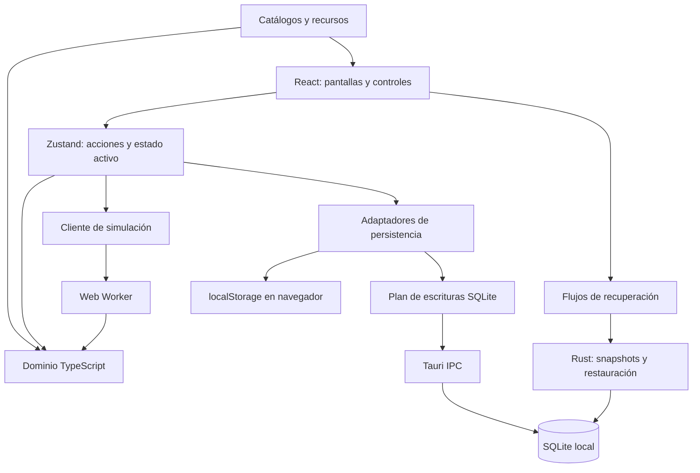
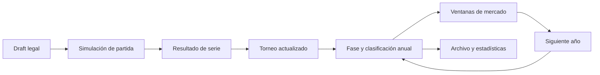

# Diseño técnico de DraftSim

Referencia: código de preparación de 0.6.0, septiembre de 2026. Este documento describe arquitectura y decisiones; las guías de [dominio](domain-contracts.md), [persistencia](persistence-and-recovery.md), [interacción](interaction-and-execution.md) y [desarrollo](development-and-release.md) detallan los contratos de cada subsistema.

## 1. Objetivo y límites

DraftSim es un simulador local de draft y competición inspirado en League of Legends. Combina selección de campeones, resolución de partidas, series, torneos, temporadas y realidades de varios años. El usuario puede intervenir o delegar la simulación.

El objetivo es que composición, jugadores, estrategia y calendario tengan consecuencias reconocibles. No se ejecutan todas las reglas del cliente del videojuego ni se reproduce cada parche al detalle. El resultado es un modelo probabilístico con explicaciones y estadísticas que permiten analizar la competición.

El instalador contiene un frontend estático. No necesita un servidor Next.js en producción ni un backend remoto para guardar partidas. Algunas imágenes y actualizaciones de catálogo pueden requerir red: aplicación local no significa que todos los recursos externos estén disponibles offline.

La arquitectura descrita no incluye autenticación multiusuario, sincronización automática entre dispositivos ni un servidor de competición. Exportar una realidad no equivale a disponer de colaboración concurrente.

## 2. Componentes y fronteras

| Capa | Ubicación | Responsabilidad y restricción |
|---|---|---|
| Arranque | `app/`, `next.config.ts` | Cargar y exportar la interfaz; no depender de APIs de servidor en producción |
| Presentación | `components/` | Interacción y visualización; no inventar resultados históricos |
| Orquestación | `store/draftStore.ts`, `store/actions/` | Coordinar mutaciones, operaciones y persistencia |
| Dominio | `lib/draftAI/`, `lib/sim/`, `lib/season/` | Reglas de competición, identidad y evolución |
| Adaptadores | `lib/desktopStorage.ts`, `lib/desktopSqlite*.ts` | Hidratación, colas, codificación y diferencias SQL |
| Nativo | `src-tauri/src/` | Transacciones, archivos, backups y ventana |
| Distribución | `scripts/`, `.github/workflows/` | Validar y publicar artefactos del commit previsto |

Las fronteras fundamentales separan presentación de reglas, memoria de almacenamiento confirmado y JavaScript de operaciones nativas. Una pantalla que muestra una mutación inmediatamente no demuestra que esa mutación haya llegado al disco.

El núcleo de reglas se puede probar sin React. Sin embargo, `lib/` también contiene hooks y adaptadores de navegador: no toda esa carpeta es código puro ni seguro para ejecutar dentro de un worker.

## 3. Plataforma y arranque

El frontend utiliza Next.js 16, React 19, TypeScript, Zustand 5 y Tailwind CSS. Tauri 2 proporciona el shell; Windows renderiza mediante WebView2. SQLite se accede mediante el plugin SQL y comandos propios en Rust para operaciones transaccionales.

`next.config.ts` establece `output: "export"`. El build produce `out/`, referenciado desde `frontendDist` en la configuración Tauri. En desarrollo, Tauri ejecuta `beforeDevCommand` y abre el servidor de `localhost:3000`. Compilación bajo demanda, HMR y peticiones de desarrollo pueden producir tiempos y mensajes que no existen en el instalador.

La identidad nativa es `app.draftsim.desktop`. Cambiarla puede cambiar la ubicación de AppData y hacer parecer que se perdieron partidas. Debe conservarse entre versiones ordinarias. El nombre del ejecutable, el identificador de aplicación y la versión comercial son propiedades distintas.

El catálogo base de campeones está empaquetado. `lib/communityDragon.ts` gestiona consultas complementarias. Un fallo HTTP de Meraki no demuestra un fallo de SQLite: catálogo y persistencia deben diagnosticarse por separado.

## 4. Modelo de datos por agregados

| Agregado | Función |
|---|---|
| Draft | Turnos, elecciones, bloqueos y restricciones de posición |
| Serie | Partidas y resultado acumulado de dos equipos |
| `TournamentState` | Formato, encuentros, clasificación y progreso |
| `SeasonState` | Equipos, calendario, torneos, configuración y evolución anual |
| Realidad | ID, nombre, año, temporada actual e historial |
| `SeasonHistoryEntry` | Snapshot anual para timeline, búsquedas y récords |
| Jugador | Identidad estable, capacidades y trayectoria |
| Evento de plantilla | Snapshot de participantes y procedencia temporal |

`SeasonState.tournaments` es un mapa por ID. `phases` describe el calendario y `phaseIndex` la fase actual. Cada fase referencia sus torneos. La franquicia añade año, envejecimiento, nombres reservados, jugadores inactivos y restricciones del mercado.

Los archivos históricos no deben depender de la plantilla actual para contestar quién jugó o ganó un evento. Los snapshots de fase conservan esa evidencia. Tampoco debe reconstruirse una carrera uniendo únicamente nombres: los IDs estables permiten mantenerla después de fichajes y cambios de rol.

## 5. Flujo competitivo

La IA de draft puntúa candidatos legales según meta, rol, composición, confort y oponente. Dificultad y personalidad ajustan preferencia y muestreo, pero no pueden autorizar picks ilegales. La explicación de una elección debe utilizar las mismas contribuciones que la decisión.

`lib/matchSimulator.ts` coordina los módulos de timeline para líneas, objetivos, peleas y cierre. Las capacidades de plantilla, composición, forma y estrategia influyen en eventos y resultado. Añadir modificadores exige comprobar que no se cuenta dos veces la misma ventaja en distintos niveles.

Los ratings derivados de partidas alimentan premios, estadísticas y decisiones de plantilla. Cambiar su fórmula es una modificación transversal del modelo competitivo, aunque el primer síntoma aparezca en una tabla de UI.

## 6. Aleatoriedad y reproducibilidad

Las funciones que aceptan RNG y los helpers de `lib/rng.ts` permiten escenarios reproducibles. La semilla por sí sola no basta: deben conservarse entradas, catálogo, configuración y orden de consumo del generador. No se garantiza igualdad exacta entre versiones que cambien las reglas.

Las pruebas deterministas detectan regresiones de lógica. Las pruebas estadísticas evalúan distribuciones y equilibrio. Un snapshot estable no demuestra equilibrio competitivo y una distribución razonable no demuestra que una regla concreta sea correcta.

## 7. Estado, identidad e inmutabilidad

Zustand actúa como coordinador. Las vistas deben seleccionar ramas concretas para evitar renders y recálculos por cambios ajenos. Los motores reciben entradas explícitas y devuelven resultados; los efectos de almacenamiento y navegación se coordinan fuera de las reglas puras.

Las cachés de codificación y persistencia utilizan referencias de objetos. Modificar una rama exige una referencia nueva; conservar una rama intacta permite reutilizar trabajo. Mutar en sitio puede ocultar un cambio a la caché, mientras reconstruir todo el árbol en cada acción destruye la optimización.

La ausencia de datos tiene semántica propia. Historial no cargado no es historial borrado; premio no documentado no es premio conocido con valor cero; etiqueta de offseason no es prueba de año de origen.

## 8. Decisiones y compensaciones

| Decisión | Beneficio | Coste o límite |
|---|---|---|
| Frontend estático en Tauri | Distribución sin servidor de aplicación | No admite depender de lógica Next de servidor |
| Motor TypeScript compartido | Reutilización en UI, worker y tests | El fallback síncrono puede bloquear la interfaz |
| SQLite con agregados JSON | Atomicidad y separación del historial | Algunos blobs crecen con la temporada |
| Historial perezoso | Reduce el coste inicial | Necesita metadatos explícitos de carga |
| Cachés por referencia | Reduce codificación y escrituras | Exige inmutabilidad e invalidación correcta |
| Fronteras de offseason por índice | Compatible con archivos existentes | Sensible a reordenación y procedencia legado |
| Dispatcher único de Esc | Una sola capa por pulsación | Todas las superficies deben integrarse |
| Pruebas del instalador | Validan integración nativa | CI más lento y dependiente de WebView2 |

## 9. Evolución propuesta

Estas propuestas no están implementadas por este documento.

**Propiedad temporal explícita de mercado.** Incorporar `seasonId`, año y `windowId` a noticias y movimientos. Mantener lectura compatible y no inventar procedencia de datos antiguos. Debe superar importación y varios rollovers sin duplicados.

**División adicional del estado global.** Medir primero volumen serializado y tiempo de commit. Separar ajustes de blobs competitivos solo si el perfil lo justifica y manteniendo atomicidad y recuperación.

**Carga perezosa de temporadas inactivas.** Requiere metadata suficiente para el selector y un estado explícito de carga. Exportar o guardar otra realidad nunca debe interpretar ausencia en memoria como borrado.

**Instrumentación local optativa.** Medir codificación, tamaño, sentencias e IPC por operación. Evitar incluir nombres, partidas completas o rutas personales en diagnósticos públicos.

**Optimización de CI.** Evaluar cachés Rust y reutilización controlada de compilación, sin mezclar artefactos de distintos commits ni publicar builds diagnósticos en lugar de los instaladores validados.

## 10. Reglas para extender la arquitectura

Identificar productores, consumidores y representación persistida antes de cambiar una entidad. Una noticia de plantilla afecta generación, digest, archivo, importación y rollover; una métrica puede afectar premios y mercado; una salida de pantalla afecta foco, guardado y cierre nativo.

Los cambios de almacenamiento deben declarar la frontera transaccional y el comportamiento ante fallo. Los cambios históricos deben preferir campos opcionales y normalización conservadora. Las nuevas superficies deben integrar Escape y sus guardas desde el inicio.

Las pruebas deben usar datos desechables representativos: varias realidades, archivos antiguos, historiales extensos y temporadas incompletas. Los planes y comentarios antiguos ayudan a entender decisiones, pero el comportamiento actual se comprueba en código y tests.
